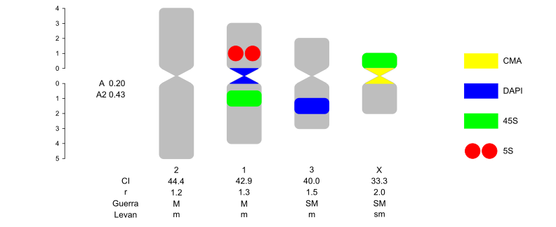
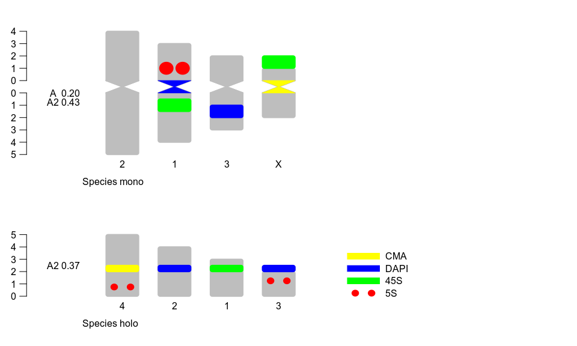

<!-- README.md is generated from README.Rmd. Please edit that file -->


# idiogramFISH<br></br>Idiograms with Marks and Karyotype Indices<br></br><br></br><br></br>

<!--  -->

<!-- height="120" -->

<!-- badges: start -->

[](https://cran.r-project.org/package=idiogramFISH)
[](https://cran.r-project.org/package=idiogramFISH)
[](https://gitlab.com/ferroao/idiogramFISH)
<br><br>
<a href="https://liberapay.com/ferroao/donate"></a>

<!-- badges: end -->

The goal of idiogramFISH is to plot idiograms of several karyotypes
having a set of dataframes for chromosome data and optionally marks’
data (`plotIdiograms`) (Roa and Telles, [2019](#ref-Roa2019)).<br>
<br>Marks can have square or dot form, its legend (label) can be drawn
inline or to the right of karyotypes. It is possible to calculate also
chromosome and karyotype indexes and classify chromosomes by morphology
(Levan *et al.*, [1964](#ref-Levan1964); Guerra,
[1986](#ref-Guerra1986d); Romero-Zarco, [1986](#ref-Zarco1986new);
Watanabe *et al.*, [1999](#ref-Watanabe1999)).

IdiogramFISH was written in R(R Core Team, [2019](#ref-R-base)) and also
uses crayon package (Csárdi, [2017](#ref-R-crayon)). Manuals were
written with R-packages bookdown, knitr, badger, pkgdown and Rmarkdown
(Allaire *et al.*, [2019](#ref-R-rmarkdown); Wickham and Hesselberth,
[2019](#ref-R-pkgdown); Xie,
[2019](#ref-R-bookdown)[a](#ref-R-bookdown),
[2019](#ref-R-knitr)[b](#ref-R-knitr); Yu,
[2019](#ref-R-badger))

## Installation

#### You can install idiogramFISH from [CRAN](https://cran.r-project.org/package=idiogramFISH) with:

``` r
install.packages("idiogramFISH")
```

#### Or the devel version of idiogramFISH

##### From gitlab with devtools (Wickham *et al.*, [2019](#ref-R-devtools))

Attention windows users, please install
[Rtools](https://cran.r-project.org/bin/windows/Rtools/)

``` r
# This installs package devtools, necessary for installing the dev version
install.packages("devtools")

url <- "https://gitlab.com/ferroao/idiogramFISH"
```

``` r
# Linux with vignettes and Windows R-32bits
devtools::install_git(url = url,build_vignettes = TRUE, force=T)
```

``` r
# Windows R-64bits and Mac with vignettes
devtools::install_git(url = url, build_opts=c("--no-resave-data","--no-manual") )
```

##### Or install it in terminal:

``` r
# clone repository:
git clone "https://gitlab.com/ferroao/idiogramFISH"

R CMD build idiogramFISH
# install
R CMD INSTALL idiogramFISH_*.tar.gz
```

#### What’s new in gitlab?

[ver.
\> 1.0.0](https://gitlab.com/ferroao/idiogramFISH/blob/master/NEWS.md)

#### Releases:

<https://gitlab.com/ferroao/idiogramFISH/-/releases>

## Need help?

#### Manual in Bookdown style

<https://ferroao.gitlab.io/manualidiogramfish/>

#### Documentation in Pkgdown style

<https://ferroao.gitlab.io/idiogramFISH>

#### Vignettes:

Online:

[Monocentrics](https://ferroao.gitlab.io/idiogramfishhelppages/AplotIdiogramsVig.html)  
[Holocentrics](https://ferroao.gitlab.io/idiogramfishhelppages/BplotIdiogramsHoloVig.html)  
[Groups of
chromosomes](https://ferroao.gitlab.io/idiogramfishhelppages/CgroupsVig.html)  
[Alongside
Phylogeny](https://ferroao.gitlab.io/idiogramfishhelppages/DphylogenyVig.html)  
[Human
karyotype](https://ferroao.gitlab.io/idiogramfishhelppages/EhumanVig.html)

Launch vignettes from R

``` r
browseVignettes("idiogramFISH") 
```

## Basic examples

#### 1 how to plot a karyotype:

Define your plotting window size with something like `par(pin=c(10,6))`

``` r
# fig.width=10, fig.height=6

library(idiogramFISH)
# load some package dataframes
data(dfOfChrSize) # chromsome data
data(dfMarkColor) # mark general data
data(dfOfMarks)   # mark position data (not cen.)
data(dfOfCenMarks)# centromeric mark data

# svg("testing.svg",width=14,height=8 )
plotIdiograms(dfChrSize=dfOfChrSize,    # data.frame of chr. size
              dfMarkColor=dfMarkColor,  # d.f of mark style                 < == Optional for ver. > 1.0.0
              dfMarkPos=dfOfMarks,      # df of mark positions (not centromeric)
              dfCenMarks=dfOfCenMarks,  # df of centromeric marks
              dotRoundCorr=2.5,         # correction of dots when non-circular
              
              chrWidth=2.5,             # width of chromosome
              chrSpacing = 2.5,         # horizontal space among chromosomes
              karHeiSpace=1.6,          # vertical size of karyotype including space
              
              indexIdTextSize=1,        # font size of chr names and indices
              markLabelSize=1,          # font size of legends
              
              rulerPos=-1.9,            # position of rulers
              ruler.tck=-0.02,          # size and orientation of ruler ticks
              rulerNumberPos=.5,        # position of numbers of rulers
              rulerNumberSize=1         # font size of rulers
              ,legend="aside"           # try this
              ,legendWidth=1            # width of legend
)
```



``` r
# dev.off()
```

#### Let’s explore the dataframes for monocentrics:

    dfOfChrSize

| chrName | shortArmSize | longArmSize |
| :------ | -----------: | ----------: |
| 1       |            3 |           4 |
| 2       |            4 |           5 |
| 3       |            2 |           3 |
| X       |            1 |           2 |

    dfMarkColor

| markName | markColor | style  |
| :------- | :-------- | :----- |
| 5S       | red       | dots   |
| 45S      | green     | square |
| DAPI     | blue      | square |
| CMA      | yellow    | square |

    dfOfMarks

| chrName | markName | markArm | markSize | markDistCen |
| :------ | :------- | :------ | -------: | ----------: |
| 1       | 5S       | p       |        1 |         0.5 |
| 1       | 45S      | q       |        1 |         0.5 |
| X       | 45S      | p       |        1 |         1.0 |
| 3       | DAPI     | q       |        1 |         1.0 |

    dfOfCenMarks

| chrName | markName |
| :------ | :------- |
| 1       | DAPI     |
| X       | CMA      |

#### 2 How to plot a karyotype of holocentrics:

function `plotIdiogramsHolo` deprecated after ver. \> 1.5.1

``` r
library(idiogramFISH)
# load some saved dataframes
data(dfChrSizeHolo, dfMarkColor, dfMarkPosHolo)

# plotIdiogramsHolo is deprecated

# svg("testing.svg",width=14,height=8 )
plotIdiograms(dfChrSize=dfChrSizeHolo, # data.frame of chr. size
                  dfMarkColor=dfMarkColor, # df of mark style
                  dfMarkPos=dfMarkPosHolo, # df of mark positions
                  addOTUName=FALSE,        # do not add OTU names
                  
                  dotRoundCorr=2.5,        # correction of roundness of dots (marks)  
                  chrWidth=2.5,            # chr. width
                  indexIdTextSize=1,       # font size of chr. name and indices
                  legend="aside" ,         # legend of marks to the right of plot
                  markLabelSize=1,         # font size of mark labels (legend)
                  
                  rulerNumberSize=1,       # font size of ruler
                  rulerPos=-.7,            # position of ruler
                  ruler.tck=-0.04,         # size and orientation of ruler ticks
                  rulerNumberPos=.9,       # position of numbers of rulers
                  
                  xlimLeftMod=1,           # modify xlim left argument of plot
                  xlimRightMod=10,         # modify xlim right argument of plot
                  ylimBotMod=.2            # modify ylim bottom argument of plot
                  ,legendHeight=.5         # height of legend labels
                  ,legendWidth = 1.2)      # width of legend labels
```


``` r
# dev.off()
```

#### Let’s explore the dataframes for holocentrics:

    dfChrSizeHolo

| chrName | chrSize |
| ------: | ------: |
|       1 |       3 |
|       2 |       4 |
|       3 |       2 |
|       4 |       5 |

    dfMarkColor

| markName | markColor | style  |
| :------- | :-------- | :----- |
| 5S       | red       | dots   |
| 45S      | green     | square |
| DAPI     | blue      | square |
| CMA      | yellow    | square |

    dfMarkPosHolo

| chrName | markName | markPos | markSize |
| ------: | :------- | ------: | -------: |
|       3 | 5S       |     1.0 |      0.5 |
|       3 | DAPI     |     2.0 |      0.5 |
|       1 | 45S      |     2.0 |      0.5 |
|       2 | DAPI     |     2.0 |      0.5 |
|       4 | CMA      |     2.0 |      0.5 |
|       4 | 5S       |     0.5 |      0.5 |

#### 3\. Plotting both mono. and holo.

Available only for ver. \> 1.5.1  
Merge data.frames with plyr (Wickham, [2016](#ref-R-plyr))

``` r
# chromsome data, if only 1 species, column OTU is optional
require(plyr)
dfOfChrSize$OTU  <-"Species mono"
dfChrSizeHolo$OTU<-"Species holo"
 
monoholoCS <- plyr::rbind.fill(dfOfChrSize,dfChrSizeHolo)

dfOfMarks$OTU     <-"Species mono"
dfMarkPosHolo$OTU <-"Species holo"

monoholoMarks <- plyr::rbind.fill(dfOfMarks,dfMarkPosHolo)

dfOfCenMarks$OTU <-"Species mono"
```

``` r
library(idiogramFISH)
# load some saved dataframes

# function plotIdiogramsHolo deprecated for ver. > 1.5.1
par(mar=rep(0,4))

# svg("testing.svg",width=14,height=10 )
plotIdiograms(dfChrSize  = monoholoCS,   # data.frame of chr. size
              dfMarkColor= dfMarkColor,  # df of mark style
              dfMarkPos  = monoholoMarks,# df of mark positions
              dfCenMarks = dfOfCenMarks, # d.f. of cen. marks  
              roundness = 8,             # vertices roundness
              dotRoundCorr=1.5,          # correction of roundness of dots (marks)  
              
              addOTUName = TRUE,         # add OTU names
              OTUTextSize = 1,           # OTU name font size
              
              chrWidth=2.5,              # chr. width
              indexIdTextSize=1,         # font size of chr. name and indices
              
              legend="aside" ,           # legend of marks to the right of plot
              markLabelSize=1,           # font size of mark labels (legend)
              legendHeight=.5,           # height of legend labels
              legendWidth = 1,           # width of legend labels

              rulerNumberSize=1,         # font size of ruler
              rulerPos= -1.8,            # position of ruler
              ruler.tck=-0.02,           # size and orientation of ruler ticks
              rulerNumberPos=.9,         # position of numbers of rulers
              
              xlimLeftMod=4,             # modify xlim left argument of plot
              xlimRightMod=10,           # modify xlim right argument of plot
              ylimBotMod=-.2             # modify ylim bottom argument of plot
)
```



``` r
#dev.off()
```

## Citation

To cite idiogramFISH in publications, please use:

Roa F, Telles MPC. 2019. idiogramFISH: Idiograms with Marks and
Karyotype Indices, Universidade Federal de Goiás. Brazil. R-package.
<https://ferroao.gitlab.io/manualidiogramfish/>

## Authors

[Fernando Roa](https://ferroao.gitlab.io/curriculumpu/)  
[Mariana Telles](http://lattes.cnpq.br/4648436798023532)

## References

<div id="refs" class="references">

<div id="ref-R-rmarkdown">

Allaire J, Xie Y, McPherson J, Luraschi J, Ushey K, Atkins A, Wickham H,
Cheng J, Chang W, Iannone R. 2019. *Rmarkdown: Dynamic documents for r*.
<https://CRAN.R-project.org/package=rmarkdown> 

</div>

<div id="ref-R-crayon">

Csárdi G. 2017. *Crayon: Colored terminal output*.
<https://CRAN.R-project.org/package=crayon> 

</div>

<div id="ref-Guerra1986d">

Guerra M. 1986. Reviewing the chromosome nomenclature of Levan et al.
*Brazilian Journal of Genetics*, 9(4): 741–743 

</div>

<div id="ref-Levan1964">

Levan A, Fredga K, Sandberg AA. 1964. Nomenclature for centromeric
position on chromosomes *Hereditas*, 52(2): 201–220.
<https://doi.org/10.1111/j.1601-5223.1964.tb01953.x> 

</div>

<div id="ref-R-base">

R Core Team. 2019. *R: A language and environment for statistical
computing* R Foundation for Statistical Computing: Vienna, Austria.
<https://www.R-project.org/> 

</div>

<div id="ref-Roa2019">

Roa F, Telles MP. 2019. *idiogramFISH: Idiograms with marks and
karyotype indices* Universidade Federal de Goiás: UFG, Goiânia.
<https://ferroao.gitlab.io/manualidiogramfish/> 

</div>

<div id="ref-Zarco1986new">

Romero-Zarco C. 1986. A new method for estimating karyotype asymmetry
*Taxon*, 35(3): 526–530.
<https://onlinelibrary.wiley.com/doi/abs/10.2307/1221906> 

</div>

<div id="ref-Watanabe1999">

Watanabe K, Yahara T, Denda T, Kosuge K. 1999. Chromosomal evolution in
the genus Brachyscome (Asteraceae, Astereae): statistical tests
regarding correlation between changes in karyotype and habit using
phylogenetic information *Journal of Plant Research*, 145–161.
<http://link.springer.com/article/10.1007/PL00013869> 

</div>

<div id="ref-R-plyr">

Wickham H. 2016. *Plyr: Tools for splitting, applying and combining
data*. <https://CRAN.R-project.org/package=plyr> 

</div>

<div id="ref-R-pkgdown">

Wickham H, Hesselberth J. 2019. *Pkgdown: Make static html documentation
for a package*. <https://CRAN.R-project.org/package=pkgdown> 

</div>

<div id="ref-R-devtools">

Wickham H, Hester J, Chang W. 2019. *Devtools: Tools to make developing
r packages easier*. <https://CRAN.R-project.org/package=devtools> 

</div>

<div id="ref-R-bookdown">

Xie Y. 2019a. *Bookdown: Authoring books and technical documents with r
markdown*. <https://github.com/rstudio/bookdown> 

</div>

<div id="ref-R-knitr">

Xie Y. 2019b. *Knitr: A general-purpose package for dynamic report
generation in r*. <https://CRAN.R-project.org/package=knitr> 

</div>

<div id="ref-R-badger">

Yu G. 2019. *Badger: Badge for r package*.
<https://CRAN.R-project.org/package=badger> 

</div>

</div>
