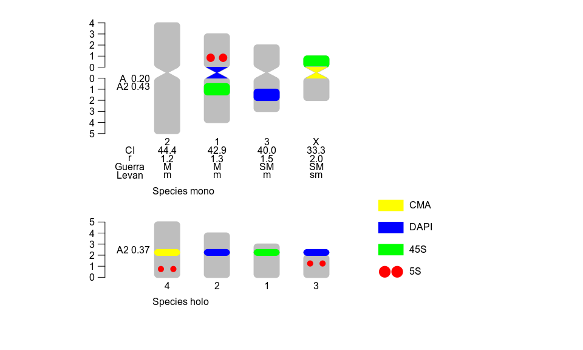
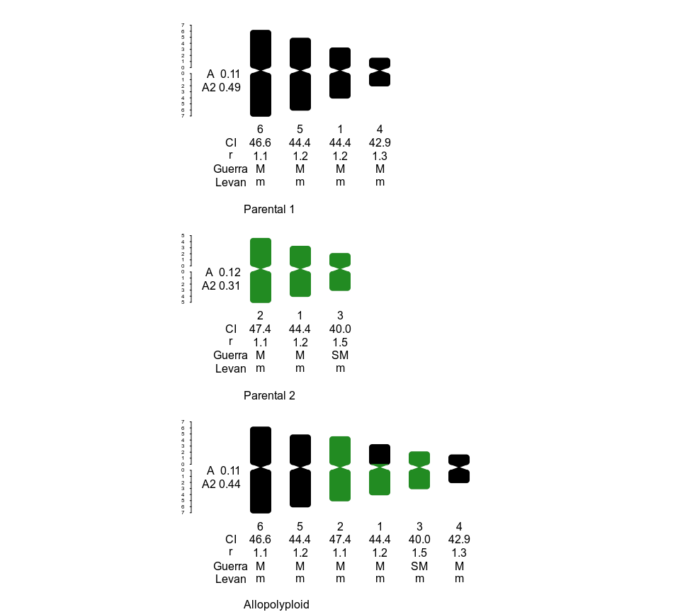

idiogramFISH
================

<!-- README.md is generated from README.Rmd. Please edit that file -->


# Idiograms with Marks and Karyotype Indices<br></br><br></br><br></br><br></br>

<!--  -->

<!-- height="120" -->

  
  <br></br>
[](https://liberapay.com/ferroao/donate)[](https://liberapay.com/ferroao/donate)
<!-- badges: end -->

The goal of idiogramFISH is to plot idiograms of several karyotypes
having a set of dataframes for chromosome data and optionally marks’
data (`plotIdiograms`) (Roa and Telles, [2019](#ref-Roa2019)).<br>
<br>Marks can have square or dot form, its legend (label) can be drawn
inline or to the right of karyotypes. It is possible to calculate also
chromosome and karyotype indexes and classify chromosomes by morphology
(Levan *et al.*, [1964](#ref-Levan1964); Guerra,
[1986](#ref-Guerra1986d); Romero-Zarco, [1986](#ref-Zarco1986new);
Watanabe *et al.*, [1999](#ref-Watanabe1999)).

IdiogramFISH was written in R(R Core Team, [2019](#ref-R-base)) and also
uses crayon package (Csárdi, [2017](#ref-R-crayon)). Manuals were
written with R-packages bookdown, knitr, pkgdown and Rmarkdown (Allaire
*et al.*, [2019](#ref-R-rmarkdown); Wickham and Hesselberth,
[2019](#ref-R-pkgdown); Xie,
[2019](#ref-R-bookdown)[a](#ref-R-bookdown),
[2019](#ref-R-knitr)[b](#ref-R-knitr))

<!-- badger -->

## Installation

#### You can install idiogramFISH from [CRAN](https://cran.r-project.org/package=idiogramFISH) with:

``` r
install.packages("idiogramFISH")
```

#### Or the devel version of idiogramFISH

##### From gitlab with devtools (Wickham *et al.*, [2019](#ref-R-devtools)[b](#ref-R-devtools))

Attention windows users, please install
[Rtools](https://cran.r-project.org/bin/windows/Rtools/) and
[git](https://git-scm.com/download/win)

``` r
# This installs package devtools, necessary for installing the dev version
install.packages("devtools")

url <- "https://gitlab.com/ferroao/idiogramFISH"
```

``` r
# Necessary packages for vignettes:
list.of.packages <- c(
    "knitr",
    "kableExtra",
    "prettydoc",
    "rmarkdown",
    "RCurl",
    "rvcheck"
    )
new.packages <- list.of.packages[!(list.of.packages %in% installed.packages()[,"Package"])]
if(length(new.packages)) install.packages(new.packages)
```

``` r
# Linux with vignettes and Windows
devtools::install_git(url = url,build_vignettes = TRUE, force=T)
```

``` r
# Mac with vignettes
devtools::install_git(url = url, build_opts=c("--no-resave-data","--no-manual") )
```

##### Or install it in terminal:

``` r
# clone repository:
git clone "https://gitlab.com/ferroao/idiogramFISH"

R CMD build idiogramFISH
# install
R CMD INSTALL idiogramFISH_*.tar.gz
```

#### What’s new in gitlab?

[ver.
\> 1.0.0](https://gitlab.com/ferroao/idiogramFISH/blob/master/NEWS.md)

#### Releases:

<https://gitlab.com/ferroao/idiogramFISH/-/releases>

## Need help?

#### Manual in Bookdown style

<https://ferroao.gitlab.io/manualidiogramfish/>

#### Documentation in Pkgdown style

<https://ferroao.gitlab.io/idiogramFISH>

#### Vignettes:

Online:

[Monocentrics](https://ferroao.gitlab.io/idiogramfishhelppages/AplotIdiogramsVig.html)  
[Holocentrics](https://ferroao.gitlab.io/idiogramfishhelppages/BplotIdiogramsHoloVig.html)  
[Groups of
chromosomes](https://ferroao.gitlab.io/idiogramfishhelppages/CgroupsVig.html)  
[Alongside
Phylogeny](https://ferroao.gitlab.io/idiogramfishhelppages/DphylogenyVig.html)  
[Human
karyotype](https://ferroao.gitlab.io/idiogramfishhelppages/EhumanVig.html)

Launch vignettes from R:

``` r
browseVignettes("idiogramFISH") 
```

## Basic examples

#### 1 How to plot a karyotype:

Define your plotting window size with something like `par(pin=c(10,6))`

``` r

library(idiogramFISH)

data(dfOfChrSize) # chromsome data
data(dfMarkColor) # mark general data
data(dfOfMarks2)  # mark position data (inc. cen.)

# svg("testing.svg",width=11,height=4.5 )

opar <- par(no.readonly = TRUE)      # make a copy of current settings
par(mar = c(0, 0, 0, 0), omi=rep(0,4), oma=rep(0,4) )

plotIdiograms(dfChrSize=dfOfChrSize,    # data.frame of chr. size
              dfMarkColor=dfMarkColor,  # d.f of mark style                 < == Optional for ver. > 1.0.0
              dfMarkPos=dfOfMarks2,     # df of mark positions (includes cen. marks)
              
              rulerPos=-.9,             # position of rulers
              ruler.tck=-0.01,          # size and orientation of ruler ticks
              rulerNumberSize=.8        # font size of rulers
              
              ,legendWidth=1            # width of legend items
              ,distTextChr = .5         # chr. text separation
              
              ,xlimLeftMod = 2          # xlim left param.
              ,ylimBotMod = 0           # modify ylim bottom argument
              ,ylimTopMod = 0           # modify ylim top argument
              ,asp=1                    # y/x aspect, see ?plot
)
```


``` r

# par(opar)
# dev.off() # close svg()
```

#### Let’s explore the dataframes for monocentrics:

    dfOfChrSize

| chrName | shortArmSize | longArmSize |
| :------ | -----------: | ----------: |
| 1       |            3 |           4 |
| 2       |            4 |           5 |
| 3       |            2 |           3 |
| X       |            1 |           2 |

    dfMarkColor

| markName | markColor | style  |
| :------- | :-------- | :----- |
| 5S       | red       | dots   |
| 45S      | green     | square |
| DAPI     | blue      | square |
| CMA      | yellow    | square |

`p, q` and `w` marks can have empty columns `markDistCen` and `markSize`
since v. 1.9.1 to plot whole arms (`p`, `q`) and whole chr. `w`.

    dfOfMarks2

| chrName | markName | chrRegion | markSize | markDistCen |
| :------ | :------- | :-------- | -------: | ----------: |
| 1       | 5S       | p         |        1 |         0.5 |
| 1       | 45S      | q         |        1 |         0.5 |
| X       | 45S      | p         |       NA |          NA |
| 3       | DAPI     | q         |        1 |         1.0 |
| 1       | DAPI     | cen       |       NA |          NA |
| X       | CMA      | cen       |       NA |          NA |

#### 2 How to plot a karyotype of holocentrics:

function `plotIdiogramsHolo` deprecated after ver. \> 1.5.1

``` r
library(idiogramFISH)

# load some package data.frames
data(dfChrSizeHolo, dfMarkColor, dfMarkPosHolo)

# plotIdiogramsHolo is deprecated
par(mar = c(0, 0, 0, 0), omi=rep(0,4), oma=rep(0,4) )
# svg("testing.svg",width=14,height=8 )
plotIdiograms(dfChrSize=dfChrSizeHolo, # data.frame of chr. size
              dfMarkColor=dfMarkColor, # df of mark style
              dfMarkPos=dfMarkPosHolo, # df of mark positions
              addOTUName=FALSE,        # do not add OTU names
              
              distTextChr = .5,        # chr. name distance to chr.
              
              rulerPos=-.9,            # position of ruler
              rulerNumberPos=.9,       # position of numbers of rulers
              
              xlimLeftMod=2,           # modify xlim left argument of plot
              ylimBotMod=.2            # modify ylim bottom argument of plot
              ,legendHeight=.5         # height of legend labels
              ,legendWidth = 1.2       # width of legend labels
              ,asp=1)                  # y/x aspect
```


``` r
# dev.off() # close svg()
```

#### Let’s explore the dataframes for holocentrics:

    dfChrSizeHolo

| chrName | chrSize |
| ------: | ------: |
|       1 |       3 |
|       2 |       4 |
|       3 |       2 |
|       4 |       5 |

    dfMarkColor

| markName | markColor | style  |
| :------- | :-------- | :----- |
| 5S       | red       | dots   |
| 45S      | green     | square |
| DAPI     | blue      | square |
| CMA      | yellow    | square |

    dfMarkPosHolo

| chrName | markName | markPos | markSize |
| ------: | :------- | ------: | -------: |
|       3 | 5S       |     1.0 |      0.5 |
|       3 | DAPI     |     2.0 |      0.5 |
|       1 | 45S      |     2.0 |      0.5 |
|       2 | DAPI     |     2.0 |      0.5 |
|       4 | CMA      |     2.0 |      0.5 |
|       4 | 5S       |     0.5 |      0.5 |

#### 3\. Plotting both mono. and holo.

Available only for ver. \> 1.5.1

Merge data.frames with plyr (Wickham, [2016](#ref-R-plyr))

``` r
# chromsome data, if only 1 species, column OTU is optional
require(plyr)
dfOfChrSize$OTU   <- "Species mono"
dfChrSizeHolo$OTU <- "Species holo"
 
monoholoCS <- plyr::rbind.fill(dfOfChrSize,dfChrSizeHolo)

dfOfMarks2$OTU     <-"Species mono"
dfOfMarks2[which(dfOfMarks2$markName=="5S"),]$markSize<-.7
dfMarkPosHolo$OTU <-"Species holo"

monoholoMarks <- plyr::rbind.fill(dfOfMarks2,dfMarkPosHolo)
```

``` r
library(idiogramFISH)
# load some saved dataframes

# function plotIdiogramsHolo deprecated for ver. > 1.5.1
par(mar=rep(0,4))

# svg("testing.svg",width=14,height=10 )
plotIdiograms(dfChrSize  = monoholoCS,   # data.frame of chr. size
              dfMarkColor= dfMarkColor,  # df of mark style
              dfMarkPos  = monoholoMarks,# df of mark positions, includes cen. marks
              
              roundness = 4,             # vertices roundness
              addOTUName = TRUE,         # add OTU names
              
              karHeiSpace = 3,           # karyotype height inc. spacing
              karIndexPos = .2,          # move karyotype index
              
              legendHeight= 1,           # height of legend labels
              legendWidth = 1,           # width of legend labels
              
              rulerPos= -0.5,            # position of ruler
              ruler.tck=-0.02,           # size and orientation of ruler ticks
              rulerNumberPos=.9,         # position of numbers of rulers
              
              xlimLeftMod=1,             # modify xlim left argument of plot
              xlimRightMod=3,            # modify xlim right argument of plot
              ylimBotMod=-.2             # modify ylim bottom argument of plot
              ,asp=1                     # y x aspect ratio
)
```



``` r
#dev.off() # close svg()
```

#### 4\. Plotting GISH results

Available only for ver. \> 1.8.3

``` r
library(idiogramFISH)
# load some saved dataframes

par(mar=rep(0,4))

# svg("allo.svg",width=10,height=9 )

par(mar = c(0, 0, 0, 0), omi=rep(0,4), oma=rep(0,4) )

plotIdiograms(dfChrSize = parentalAndHybChrSize,  # d.f. of chr. sizes
              dfMarkPos = dfAlloParentMarks,      # d.f. of marks' positions
              cenColor  = NULL                    # cen. color when GISH
              
              ,karHeiSpace=5,                     # karyotype height including spacing
              karSepar = FALSE,                   # equally sized karyotypes       
              
              rulerPos=-1,                        # ruler position
              ruler.tck= -0.002,                  # ruler tick orientation and length
              rulerNumberSize=.5                  # ruler font size
              ,legend=""                          # no legend
              ,asp=1                              # y x aspect ratio

              ,ylimBotMod = 1                     # modifiy ylim bottom argument
              ,xlimRightMod = 0                   # modify xlim right argument
              
)
```



``` r
#dev.off() # close svg()
```

#### Let’s explore the dataframes for GISH:

    parentalAndHybChrSize

| OTU           | chrName | shortArmSize | longArmSize |
| :------------ | :------ | -----------: | ----------: |
| Parental 1    | 1       |          3.2 |           4 |
| Parental 1    | 4       |          1.5 |           2 |
| Parental 1    | 5       |          4.8 |           6 |
| Parental 1    | 6       |          6.1 |           7 |
| Parental 2    | 1       |          3.2 |           4 |
| Parental 2    | 2       |          4.5 |           5 |
| Parental 2    | 3       |          2.0 |           3 |
| Allopolyploid | 1       |          3.2 |           4 |
| Allopolyploid | 2       |          4.5 |           5 |
| Allopolyploid | 3       |          2.0 |           3 |
| Allopolyploid | 4       |          1.5 |           2 |
| Allopolyploid | 5       |          4.8 |           6 |
| Allopolyploid | 6       |          6.1 |           7 |

Use `p` for short arm, `q` for long arm, and `w` for whole chromosome
mark.

    dfAlloParentMarks

| OTU           | chrName | markName   | chrRegion |
| :------------ | ------: | :--------- | :-------- |
| Allopolyploid |       1 | Parental 1 | p         |
| Allopolyploid |       1 | Parental 2 | q         |
| Allopolyploid |       1 | Parental 2 | cen       |
| Allopolyploid |       2 | Parental 2 | w         |
| Allopolyploid |       3 | Parental 2 | w         |
| Allopolyploid |       4 | Parental 1 | w         |
| Allopolyploid |       5 | Parental 1 | w         |
| Allopolyploid |       6 | Parental 1 | w         |
| Parental 1    |       6 | Parental 1 | w         |
| Parental 1    |       5 | Parental 1 | w         |
| Parental 1    |       1 | Parental 1 | w         |
| Parental 1    |       4 | Parental 1 | w         |
| Parental 2    |       2 | Parental 2 | w         |
| Parental 2    |       1 | Parental 2 | w         |
| Parental 2    |       3 | Parental 2 | w         |

## Citation

To cite idiogramFISH in publications, please use:

Roa F, Telles MPC. 2019. idiogramFISH: Idiograms with Marks and
Karyotype Indices, Universidade Federal de Goiás. Brazil. R-package.
<https://ferroao.gitlab.io/manualidiogramfish/>

## Authors

[Fernando Roa](https://ferroao.gitlab.io/curriculumpu/)  
[Mariana Telles](http://lattes.cnpq.br/4648436798023532)

## References

<div id="refs" class="references">

<div id="ref-R-rmarkdown">

Allaire J, Xie Y, McPherson J, Luraschi J, Ushey K, Atkins A, Wickham H,
Cheng J, Chang W, Iannone R. 2019. *Rmarkdown: Dynamic documents for r*.
<https://CRAN.R-project.org/package=rmarkdown> 

</div>

<div id="ref-R-crayon">

Csárdi G. 2017. *Crayon: Colored terminal output*.
<https://CRAN.R-project.org/package=crayon> 

</div>

<div id="ref-Guerra1986d">

Guerra M. 1986. Reviewing the chromosome nomenclature of Levan et al.
*Brazilian Journal of Genetics*, 9(4): 741–743 

</div>

<div id="ref-Levan1964">

Levan A, Fredga K, Sandberg AA. 1964. Nomenclature for centromeric
position on chromosomes *Hereditas*, 52(2): 201–220.
<https://doi.org/10.1111/j.1601-5223.1964.tb01953.x> 

</div>

<div id="ref-R-base">

R Core Team. 2019. *R: A language and environment for statistical
computing* R Foundation for Statistical Computing: Vienna, Austria.
<https://www.R-project.org/> 

</div>

<div id="ref-Roa2019">

Roa F, Telles MP. 2019. *idiogramFISH: Idiograms with marks and
karyotype indices* Universidade Federal de Goiás: UFG, Goiânia.
<https://ferroao.gitlab.io/manualidiogramfish/> 

</div>

<div id="ref-Zarco1986new">

Romero-Zarco C. 1986. A new method for estimating karyotype asymmetry
*Taxon*, 35(3): 526–530.
<https://onlinelibrary.wiley.com/doi/abs/10.2307/1221906> 

</div>

<div id="ref-Watanabe1999">

Watanabe K, Yahara T, Denda T, Kosuge K. 1999. Chromosomal evolution in
the genus Brachyscome (Asteraceae, Astereae): statistical tests
regarding correlation between changes in karyotype and habit using
phylogenetic information *Journal of Plant Research*, 145–161.
<http://link.springer.com/article/10.1007/PL00013869> 

</div>

<div id="ref-R-plyr">

Wickham H. 2016. *Plyr: Tools for splitting, applying and combining
data*. <https://CRAN.R-project.org/package=plyr> 

</div>

<div id="ref-R-dplyr">

Wickham H, François R, Henry L, Müller K. 2019a. *Dplyr: A grammar of
data manipulation*. <https://CRAN.R-project.org/package=dplyr> 

</div>

<div id="ref-R-pkgdown">

Wickham H, Hesselberth J. 2019. *Pkgdown: Make static html documentation
for a package*. <https://CRAN.R-project.org/package=pkgdown> 

</div>

<div id="ref-R-devtools">

Wickham H, Hester J, Chang W. 2019b. *Devtools: Tools to make developing
r packages easier*. <https://CRAN.R-project.org/package=devtools> 

</div>

<div id="ref-R-bookdown">

Xie Y. 2019a. *Bookdown: Authoring books and technical documents with r
markdown*. <https://github.com/rstudio/bookdown> 

</div>

<div id="ref-R-knitr">

Xie Y. 2019b. *Knitr: A general-purpose package for dynamic report
generation in r*. <https://CRAN.R-project.org/package=knitr> 

</div>

</div>
