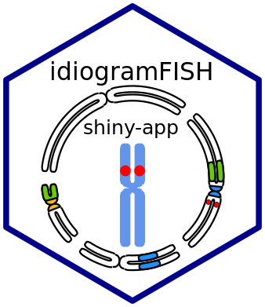

<!-- README.md is generated from README.Rmd. Please edit that file -->

# idiogramFISH 

<!-- badges: start -->

<!-- badges: end -->

The goal of idiogramFISH is to plot idiograms of several karyotypes
having a set of dataframes for chromosome data and optionally marks’
data. Includes also a function to plot holocentrics and its marks. Give
sizes in micrometers or Mb (plotIdiogramsHolo function).<br> <br>Marks
can have square or dot form, its legend (label) can be drawn inline or
to the right of karyotypes. It is possible to calculate also chromosome
and karyotype indexes and classify chromosomes by morphology.

### Installation

You can install the idiogramFISH from [CRAN](https://CRAN.R-project.org)
with:

``` r
install.packages("idiogramFISH")
# if CRAN submission is not ready try dev version below
```

Or the dev version of idiogramFISH from gitlab with
devtools:

``` r
# This installs package devtools, necessary for installing the dev version
install.packages("devtools")
url <- "https://gitlab.com/ferroao/idiogramFISH"

# if you want to install the latest dev version:
devtools::install_git(url = url,build_vignettes = TRUE, force=T)

# Attention windows users, please install Rtools from:
# https://cran.r-project.org/bin/windows/Rtools/
```

Or install it in terminal:

``` r
# clone repository:
git clone "https://gitlab.com/ferroao/idiogramFISH"
R CMD build idiogramFISH
R CMD install idiogramFISH_1.0.0.tar.gz
```

### Basic examples

##### 1 how to plot a karyotype:

``` r
library(idiogramFISH)
# load some package dataframes
data(dfOfChrSize) # chromsome data
data(dfMarkColor) # mark general data
data(dfOfMarks)   # mark position data (not cen.)
data(dfOfCenMarks)# centromeric mark data

plotIdiograms(dfOfChrSize, dfMarkColor, dfOfMarks, dfOfCenMarks,
              dotRoundCorr=2, chrWidth=2.5, chrSpacing = 2.5,
              karSpacing=1.6, 
              indexIdTextSize=1, 
              markLabelSize=1, 
              rulerPos=-1.9, ruler.tck=-0.02, rulerNumberPos=.5, rulerNumberSize=1
)
```


##### 2 How to plot a karyotype of holocentrics:

``` r
library(idiogramFISH)
# load some saved dataframes
data(dfChrSizeHolo, dfMarkColor, dfMarkPosHolo)

plotIdiogramsHolo(dfChrSizeHolo, dfMarkColor, dfMarkPosHolo, 
                        dotRoundCorr=2.5, chrWidth=2.5,
                        indexIdTextSize=1, 
                        legend="aside" ,markLabelSize=1, 
                        addOTUName=FALSE,
                        rulerNumberSize=1, rulerPos=-.7,ruler.tck=-0.04,rulerNumberPos=.9, 
                        xlimLeftMod=1,  xlimRightMod=10, ylimBotMod=.2
                        )
```


##### Let’s explore the dataframes for monocentrics:

<!-- <style> -->

<!-- .verysmall td {line-height: 10px; vertical-align: bottom; -->

<!--     font-size:8pt; -->

<!--     padding-top:3px; -->

<!--     padding-bottom:0px; -->

<!--     horizontal-align: center; -->

<!--     } -->

<!-- </style> -->

<!-- <div class="verysmall"> -->

``` r

# chromsome data, if only 1 species, column OTU is optional
dfOfChrSize
```

<div class="kable-table">

| chrName | shortArmSize | longArmSize |
| :------ | -----------: | ----------: |
| 1       |            3 |           4 |
| 2       |            4 |           5 |
| 3       |            2 |           3 |
| X       |            1 |           2 |

</div>

``` r
# mark general data
dfMarkColor 
```

<div class="kable-table">

| markName | markColor | style  |
| :------- | :-------- | :----- |
| 5S       | red       | dots   |
| 45S      | green     | square |
| DAPI     | blue      | square |
| CMA      | yellow    | square |

</div>

``` r
# mark position data (not cen.), if only 1 species, column OTU is optional
dfOfMarks
```

<div class="kable-table">

| chrName | markName | markArm | markSize | markDistCen |
| :------ | :------- | :------ | -------: | ----------: |
| 1       | 5S       | p       |        1 |         0.5 |
| 1       | 45S      | q       |        1 |         0.5 |
| X       | 45S      | p       |        1 |         1.0 |
| 3       | DAPI     | q       |        1 |         1.0 |

</div>

``` r
#centromeric mark data, if only 1 species, column OTU is optional
dfOfCenMarks
```

<div class="kable-table">

| chrName | markName |
| :------ | :------- |
| 1       | DAPI     |
| X       | CMA      |

</div>

<!-- </verysmall> -->

<!-- </div> -->

##### Let’s explore the dataframes for holocentrics:

<!-- <div class="verysmall"> -->

``` r
# chromsome data, if only 1 species, column OTU is optional
dfChrSizeHolo
```

<div class="kable-table">

| chrName | chrSize |
| ------: | ------: |
|       1 |       3 |
|       2 |       4 |
|       3 |       2 |
|       4 |       5 |

</div>

``` r
# mark general data
dfMarkColor 
```

<div class="kable-table">

| markName | markColor | style  |
| :------- | :-------- | :----- |
| 5S       | red       | dots   |
| 45S      | green     | square |
| DAPI     | blue      | square |
| CMA      | yellow    | square |

</div>

``` r
# mark position data (not cen.), if only 1 species, column OTU is optional
dfMarkPosHolo
```

<div class="kable-table">

| chrName | markName | markPos | markSize |
| ------: | :------- | ------: | -------: |
|       3 | 5S       |     1.0 |      0.5 |
|       3 | DAPI     |     2.0 |      0.5 |
|       1 | 45S      |     2.0 |      0.5 |
|       2 | DAPI     |     2.0 |      0.5 |
|       4 | CMA      |     2.0 |      0.5 |
|       4 | 5S       |     0.5 |      0.5 |

</div>

<!-- </div> -->

### For more examples see the vignettes

    browseVignettes("idiogramFISH") 

### Online vignettes:

<https://ferroao.gitlab.io/idiogramfishhelppages/plotIdiogramsVig.html>
<https://ferroao.gitlab.io/idiogramfishhelppages/plotIdiogramsHoloVig.html>

### Citation:

To cite idiogramFISH in publications, please use:

Roa F, Telles MPC. 2019. idiogramFISH: Idiograms with Marks and
Karyotype Indices, Universidade Federal de Goiás. Brazil. R-package.
<https://gitlab.com/ferroao/idiogramFISH>
