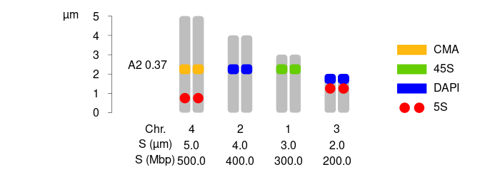

idiogramFISH
================

<!-- README.md is generated from README.Rmd. Please edit that file -->


# Idiograms with Marks and Karyotype Indices<br></br><br></br><br></br><br></br>

<!--  -->

<!-- height="120" -->

 [](https://ferroao.gitlab.io/idiogramfishhelppages/downloads.png) [](https://doi.org/10.5281/zenodo.3579417)
 
<br></br><br></br><a href='https://ko-fi.com/X7X71PZZG' target='_blank'></a>
<!-- badges: end -->

The goal of idiogramFISH is to plot idiograms of karyotypes, plasmids
and circ. chr. having a set of data.frames for chromosome data and
optionally marks’ data (`plotIdiograms` function) (Roa and PC Telles,
[2020](#ref-Roa2020)). Idiograms can also be plotted in concentric
circles. Separated chromatids can be visible when not in a circular
plot.<br> <br>Seven styles of marks are available: square, dots, cM,
cMLeft, cenStyle, upArrow, downArrow; its legend (label) can be drawn
inline or to the right of karyotypes. It is possible to calculate also
chromosome and karyotype indexes (Romero-Zarco,
[1986](#ref-Zarco1986new); Watanabe *et al.*, [1999](#ref-Watanabe1999))
and classify chromosome morphology in the categories of Levan
([1964](#ref-Levan1964)), and
[Guerra](https://ferroao.gitlab.io/guerra1986/Guerra1986.pdf)
([1986](#ref-Guerra1986d)).

IdiogramFISH was written in R (R Core Team, [2019](#ref-R-base)) and
also uses crayon (Csárdi, [2017](#ref-R-crayon)), tidyr (Wickham and
Henry, [2020](#ref-R-tidyr)) and dplyr packages (Wickham *et al.*,
[2019](#ref-R-dplyr)[a](#ref-R-dplyr)). Documentation was written with
R-packages roxygen2 (Wickham *et al.*, [2018](#ref-R-roxygen2)), usethis
(Wickham and Bryan, [2019](#ref-R-usethis)), bookdown (Xie,
[2016](#ref-bookdown2016)), knitr (Xie, [2015](#ref-Xie2015)), pkgdown
(Wickham and Hesselberth, [2019](#ref-R-pkgdown)), Rmarkdown (Xie *et
al.*, [2018](#ref-rmarkdown2018)), rvcheck (Yu,
[2019](#ref-R-rvcheck)[a](#ref-R-rvcheck)), badger (Yu,
[2019](#ref-R-badger)[b](#ref-R-badger)), kableExtra (Zhu,
[2019](#ref-R-kableExtra)), prettydoc (Qiu, [2019](#ref-R-prettydoc))
and RCurl (Temple Lang and CRAN team, [2019](#ref-R-RCurl)). For some
vignette figures, packages rentrez (Winter, [2017](#ref-rentrez2017)),
plyr (Wickham, [2011](#ref-plyr2011)), phytools (Revell,
[2012](#ref-phytools2012)), ggtree (Yu *et al.*,
[2018](#ref-ggtree2018)), ggplot2 (Wickham, [2016](#ref-ggplot22016))
and ggpubr (Kassambara, [2019](#ref-R-ggpubr)) were used.

<!-- badger -->

## Installation

#### You can install idiogramFISH from [CRAN](https://cran.r-project.org/package=idiogramFISH) with:

``` r
install.packages("idiogramFISH")
```

#### Or the devel version of idiogramFISH

##### From gitlab with devtools (Wickham *et al.*, [2019](#ref-R-devtools)[b](#ref-R-devtools))

Attention windows users, please install
[Rtools](https://cran.r-project.org/bin/windows/Rtools/) and
[git](https://git-scm.com/download/win).

Vignettes use a lua filter, so you need
[pandoc](https://pandoc.org/installing.html) ver. \> 2.
`rmarkdown::pandoc_version()`

``` r
# This installs package devtools, necessary for installing the dev version
install.packages("devtools")

url <- "https://gitlab.com/ferroao/idiogramFISH"

# Necessary packages for vignettes:
list.of.packages <- c(
    "plyr",
    "knitr",
    "kableExtra",
    "prettydoc",
    "rmarkdown",
    "RCurl",
    "rvcheck",
    "badger",
    "rentrez"
    )
new.packages <- list.of.packages[!(list.of.packages %in% installed.packages()[,"Package"])]
if(length(new.packages)) install.packages(new.packages)
```

``` r
# Linux with vignettes and Windows
devtools::install_git(url = url,build_vignettes = TRUE, force=TRUE)
```

``` r
# Mac with vignettes
devtools::install_git(url = url, build_opts=c("--no-resave-data","--no-manual") )
```

##### Or install it in terminal:

``` r
# clone repository:
git clone "https://gitlab.com/ferroao/idiogramFISH"

R CMD build idiogramFISH
# install
R CMD INSTALL idiogramFISH_*.tar.gz
```

#### Releases

[News](https://gitlab.com/ferroao/idiogramFISH/blob/master/NEWS.md)

[CRAN
archive](https://cran.r-project.org/src/contrib/Archive/idiogramFISH/)

[Download
history](https://ferroao.gitlab.io/idiogramfishhelppages/downloads.png)

## Need help?

#### Manual in Bookdown style

 [](https://ferroao.gitlab.io/manualidiogramfish/)

#### Documentation in Pkgdown style

 [](https://ferroao.gitlab.io/idiogramFISH)

#### Vignettes:

Online:

 [](https://ferroao.gitlab.io/idiogramfishhelppages)

Launch vignettes from R for the installed version:

``` r
packageVersion("idiogramFISH")
browseVignettes("idiogramFISH")
```

## Basic examples

#### 1 How to plot a karyotype:

Define your plotting window size with something like `par(pin=c(10,6))`,
or with `svg()`, `png()`, etc. Add chromosome morphology according to
[Guerra](https://ferroao.gitlab.io/guerra1986/Guerra1986.pdf)
([1986](#ref-Guerra1986d)) or (Levan *et al.*, [1964](#ref-Levan1964))

``` r

library(idiogramFISH)

data(dfOfChrSize) # chromsome data
data(dfMarkColor) # mark general data
data(dfOfMarks2)  # mark position data (inc. cen.)

dfOfMarks2[which(dfOfMarks2$markName=="5S"),]$markSize<-0.8 # modif. of mark size

# svg("testing.svg",width=11,height=4.5 )

opar <- par(no.readonly = TRUE)      # make a copy of current settings if you want to restore them later
#par(opar) # recover par

par(mar=rep(0,4))
plotIdiograms(dfChrSize=dfOfChrSize,    # data.frame of chr. size
              dfMarkColor=dfMarkColor,  # d.f of mark style <- Optional
              dfMarkPos=dfOfMarks2,     # df of mark positions (includes cen. marks)
              
              karHeight=5,              # kar. height
              chrWidth = 1.2,           # chr. width
              chrSpacing = 1,           # space among chr.
              
              morpho="Guerra",          # chr. morpho. classif. (Guerra, Levan, both, "" ) ver. >= 1.12 only
              chrIndex="CI",            # cen. pos. (CI, AR, both, "" ) ver. >= 1.12 only
              
              rulerPos= 0,              # position of ruler
              ruler.tck=-0.01,          # size and orientation of ruler ticks
              rulerNumberSize=.8        # font size of rulers
              ,ylabline= -6             # ruler units (title) pos.
              
              ,legendWidth=1            # width of legend items
              ,fixCenBorder = TRUE      # use chrColor as border color of cen. or cen. marks
              ,distTextChr = 1.2        # chr. text separation
              
              ,xlimLeftMod = 2          # xlim left param.
              ,ylimBotMod = -1          # modify ylim bottom argument
              ,ylimTopMod = 0           # modify ylim top argument
              # ,asp=1                  # y/x aspect, see ?plot
)
```


``` r
# dev.off() # close svg()
```

#### Let’s explore the data.frames for monocentrics:

    dfOfChrSize

<table>

<thead>

<tr>

<th style="text-align:left;">

chrName

</th>

<th style="text-align:right;">

shortArmSize

</th>

<th style="text-align:right;">

longArmSize

</th>

</tr>

</thead>

<tbody>

<tr>

<td style="text-align:left;">

1

</td>

<td style="text-align:right;">

3

</td>

<td style="text-align:right;">

4

</td>

</tr>

<tr>

<td style="text-align:left;">

2

</td>

<td style="text-align:right;">

4

</td>

<td style="text-align:right;">

5

</td>

</tr>

<tr>

<td style="text-align:left;">

3

</td>

<td style="text-align:right;">

2

</td>

<td style="text-align:right;">

3

</td>

</tr>

<tr>

<td style="text-align:left;">

X

</td>

<td style="text-align:right;">

1

</td>

<td style="text-align:right;">

2

</td>

</tr>

</tbody>

</table>

    dfMarkColor

<table>

<thead>

<tr>

<th style="text-align:left;">

markName

</th>

<th style="text-align:left;">

markColor

</th>

<th style="text-align:left;">

style

</th>

</tr>

</thead>

<tbody>

<tr>

<td style="text-align:left;">

5S

</td>

<td style="text-align:left;">

red

</td>

<td style="text-align:left;">

dots

</td>

</tr>

<tr>

<td style="text-align:left;">

45S

</td>

<td style="text-align:left;">

green

</td>

<td style="text-align:left;">

square

</td>

</tr>

<tr>

<td style="text-align:left;">

DAPI

</td>

<td style="text-align:left;">

blue

</td>

<td style="text-align:left;">

square

</td>

</tr>

<tr>

<td style="text-align:left;">

CMA

</td>

<td style="text-align:left;">

yellow

</td>

<td style="text-align:left;">

square

</td>

</tr>

</tbody>

</table>

`p, q` and `w` marks can have empty columns `markDistCen` and `markSize`
since v. 1.9.1 to plot whole arms (`p`, `q`) and whole chr. `w`.

    dfOfMarks2

<table>

<thead>

<tr>

<th style="text-align:left;">

chrName

</th>

<th style="text-align:left;">

markName

</th>

<th style="text-align:left;">

chrRegion

</th>

<th style="text-align:right;">

markSize

</th>

<th style="text-align:right;">

markDistCen

</th>

</tr>

</thead>

<tbody>

<tr>

<td style="text-align:left;">

1

</td>

<td style="text-align:left;">

5S

</td>

<td style="text-align:left;">

p

</td>

<td style="text-align:right;">

0.8

</td>

<td style="text-align:right;">

0.5

</td>

</tr>

<tr>

<td style="text-align:left;">

1

</td>

<td style="text-align:left;">

45S

</td>

<td style="text-align:left;">

q

</td>

<td style="text-align:right;">

1.0

</td>

<td style="text-align:right;">

0.5

</td>

</tr>

<tr>

<td style="text-align:left;">

X

</td>

<td style="text-align:left;">

45S

</td>

<td style="text-align:left;">

p

</td>

<td style="text-align:right;">

NA

</td>

<td style="text-align:right;">

NA

</td>

</tr>

<tr>

<td style="text-align:left;">

3

</td>

<td style="text-align:left;">

DAPI

</td>

<td style="text-align:left;">

q

</td>

<td style="text-align:right;">

1.0

</td>

<td style="text-align:right;">

1.0

</td>

</tr>

<tr>

<td style="text-align:left;">

1

</td>

<td style="text-align:left;">

DAPI

</td>

<td style="text-align:left;">

cen

</td>

<td style="text-align:right;">

NA

</td>

<td style="text-align:right;">

NA

</td>

</tr>

<tr>

<td style="text-align:left;">

X

</td>

<td style="text-align:left;">

CMA

</td>

<td style="text-align:left;">

cen

</td>

<td style="text-align:right;">

NA

</td>

<td style="text-align:right;">

NA

</td>

</tr>

</tbody>

</table>

#### 2 How to plot a karyotype of holocentrics:

function `plotIdiogramsHolo` deprecated after ver. \> 1.5.1

``` r
library(idiogramFISH)

# load some package data.frames - optional
data(dfChrSizeHolo, dfMarkColor, dfMarkPosHolo)

# svg("testing.svg",width=14,height=8 )

par(mar = c(0, 0, 0, 0), omi=rep(0,4), oma=rep(0,4) )
plotIdiograms(dfChrSize  =dfChrSizeHolo, # data.frame of chr. size
              dfMarkColor=dfMarkColor,   # df of mark style
              dfMarkPos  =dfMarkPosHolo, # df of mark positions
              
              addOTUName=FALSE,        # do not add OTU names
              distTextChr = .5,        # chr. name distance to chr.
              
              rulerPos=-.4,            # position of ruler
              rulerNumberPos=.9,       # position of numbers of rulers
              ylabline=-3,             # ruler units (title) pos.
              
              xlimLeftMod=2,           # modify xlim left argument of plot
              ylimBotMod=.2            # modify ylim bottom argument of plot
              ,legendHeight=.5         # height of legend labels
              ,legendWidth = 1.2       # width of legend labels
              ,xModifier = .025        # separ. among chromatids
              )                  
```



``` r
# dev.off() # close svg()
```

#### Let’s explore the data.frames for holocentrics:

    dfChrSizeHolo

<table>

<thead>

<tr>

<th style="text-align:right;">

chrName

</th>

<th style="text-align:right;">

chrSize

</th>

</tr>

</thead>

<tbody>

<tr>

<td style="text-align:right;">

1

</td>

<td style="text-align:right;">

3

</td>

</tr>

<tr>

<td style="text-align:right;">

2

</td>

<td style="text-align:right;">

4

</td>

</tr>

<tr>

<td style="text-align:right;">

3

</td>

<td style="text-align:right;">

2

</td>

</tr>

<tr>

<td style="text-align:right;">

4

</td>

<td style="text-align:right;">

5

</td>

</tr>

</tbody>

</table>

    dfMarkColor

<table>

<thead>

<tr>

<th style="text-align:left;">

markName

</th>

<th style="text-align:left;">

markColor

</th>

<th style="text-align:left;">

style

</th>

</tr>

</thead>

<tbody>

<tr>

<td style="text-align:left;">

5S

</td>

<td style="text-align:left;">

red

</td>

<td style="text-align:left;">

dots

</td>

</tr>

<tr>

<td style="text-align:left;">

45S

</td>

<td style="text-align:left;">

green

</td>

<td style="text-align:left;">

square

</td>

</tr>

<tr>

<td style="text-align:left;">

DAPI

</td>

<td style="text-align:left;">

blue

</td>

<td style="text-align:left;">

square

</td>

</tr>

<tr>

<td style="text-align:left;">

CMA

</td>

<td style="text-align:left;">

yellow

</td>

<td style="text-align:left;">

square

</td>

</tr>

</tbody>

</table>

    dfMarkPosHolo

<table>

<thead>

<tr>

<th style="text-align:right;">

chrName

</th>

<th style="text-align:left;">

markName

</th>

<th style="text-align:right;">

markPos

</th>

<th style="text-align:right;">

markSize

</th>

</tr>

</thead>

<tbody>

<tr>

<td style="text-align:right;">

3

</td>

<td style="text-align:left;">

5S

</td>

<td style="text-align:right;">

1.0

</td>

<td style="text-align:right;">

0.5

</td>

</tr>

<tr>

<td style="text-align:right;">

3

</td>

<td style="text-align:left;">

DAPI

</td>

<td style="text-align:right;">

1.5

</td>

<td style="text-align:right;">

0.5

</td>

</tr>

<tr>

<td style="text-align:right;">

1

</td>

<td style="text-align:left;">

45S

</td>

<td style="text-align:right;">

2.0

</td>

<td style="text-align:right;">

0.5

</td>

</tr>

<tr>

<td style="text-align:right;">

2

</td>

<td style="text-align:left;">

DAPI

</td>

<td style="text-align:right;">

2.0

</td>

<td style="text-align:right;">

0.5

</td>

</tr>

<tr>

<td style="text-align:right;">

4

</td>

<td style="text-align:left;">

CMA

</td>

<td style="text-align:right;">

2.0

</td>

<td style="text-align:right;">

0.5

</td>

</tr>

<tr>

<td style="text-align:right;">

4

</td>

<td style="text-align:left;">

5S

</td>

<td style="text-align:right;">

0.5

</td>

<td style="text-align:right;">

0.5

</td>

</tr>

</tbody>

</table>

#### 3\. Plotting both mono. and holo.

See vignettes for a circular version.

Merge data.frames with plyr (Wickham, [2011](#ref-plyr2011))

``` r
# chromsome data, if only 1 species, column OTU is optional
require(plyr)
dfOfChrSize$OTU   <- "Species mono"
dfChrSizeHolo$OTU <- "Species holo"
 
monoholoCS <- plyr::rbind.fill(dfOfChrSize,dfChrSizeHolo)

dfOfMarks2$OTU     <-"Species mono"
dfOfMarks2[which(dfOfMarks2$markName=="5S"),]$markSize<-.7
dfMarkPosHolo$OTU <-"Species holo"

monoholoMarks <- plyr::rbind.fill(dfOfMarks2,dfMarkPosHolo)
```

``` r
library(idiogramFISH)

# svg("testing.svg",width=10,height=6 )
par(mar=rep(0,4))
plotIdiograms(dfChrSize  = monoholoCS,   # data.frame of chr. size
              dfMarkColor= dfMarkColor,  # df of mark style
              dfMarkPos  = monoholoMarks,# df of mark positions, includes cen. marks
              
              squareness = 4,            # vertices squareness
              roundedCen = FALSE,        # triangular cen.
              addOTUName = TRUE,         # add OTU names
              OTUTextSize = .7,          # font size of OTU
              distTextChr = .5,          # separ. among chr. and text and among chr. name and indices
              
              karHeiSpace = 3,           # karyotype height inc. spacing
              karIndexPos = .2,          # move karyotype index
              
              legendHeight= 1,           # height of legend labels
              legendWidth = 1,           # width of legend labels
              fixCenBorder = TRUE,       # use chrColor as border color of cen. or cen. marks
              
              rulerPos= 0,               # position of ruler
              ruler.tck=-0.02,           # size and orientation of ruler ticks
              rulerNumberPos=.9,         # position of numbers of rulers
              ylabline=-6,               # ruler units (title) pos.
              
              xlimLeftMod=1,             # modify xlim left argument of plot
              xlimRightMod=3,            # modify xlim right argument of plot
              ylimBotMod= .2             # modify ylim bottom argument of plot
              
              ,chromatids=FALSE          # do not show separ. chromatids
              
              # for Circular Plot, add:
              
              # ,circularPlot = TRUE       # circularPlot
              # ,shrinkFactor = .9         # percentage 1 = 100% of circle with chr.
              # ,circleCenter = 3          # X coordinate of circleCenter (affects legend pos.)
              # ,chrLabelSpacing = .9      # chr. names spacing
              
              # ,OTUsrt = 0                # angle for OTU name (or number)
              # ,OTUplacing = "number"     # Use number and legend instead of name
              # ,OTULabelSpacerx = -1.6    # modify position of OTU label, when OTUplacing="number" or "simple"
              # ,OTUlegendHeight = 1.5     # space among OTU names when in legend - OTUplacing
)
```


``` r
#dev.off() # close svg()
```


## Citation

To cite idiogramFISH in publications, please use:

Roa F, Telles MPC (2020) idiogramFISH: Idiograms with Marks and
Karyotype Indices, Universidade Federal de Goiás. Brazil. R-package.
version 1.15.3 <https://ferroao.gitlab.io/manualidiogramfish/>.
doi:<!-- breaklink -->10.5281/zenodo.3579417

To write citation to file:

``` r
sink("idiogramFISH.bib")
toBibtex(citation("idiogramFISH"))
sink()
```

## Authors

[Fernando Roa](https://ferroao.gitlab.io/curriculumpu/)  
[Mariana PC Telles](http://lattes.cnpq.br/4648436798023532)

## References

<div id="refs_normal">

<div id="ref-Guerra1986d">

Guerra M. 1986. Reviewing the chromosome nomenclature of Levan et al.
*Brazilian Journal of Genetics*, 9(4): 741–743 

</div>

<div id="ref-Levan1964">

Levan A, Fredga K, Sandberg AA. 1964. Nomenclature for centromeric
position on chromosomes *Hereditas*, 52(2): 201–220.
<https://doi.org/10.1111/j.1601-5223.1964.tb01953.x>.
<https://onlinelibrary.wiley.com/doi/abs/10.1111/j.1601-5223.1964.tb01953.x>

</div>

<div id="ref-Zarco1986new">

Romero-Zarco C. 1986. A new method for estimating karyotype asymmetry
*Taxon*, 35(3): 526–530.
<https://onlinelibrary.wiley.com/doi/abs/10.2307/1221906> 

</div>

<div id="ref-Watanabe1999">

Watanabe K, Yahara T, Denda T, Kosuge K. 1999. Chromosomal evolution in
the genus Brachyscome (Asteraceae, Astereae): statistical tests
regarding correlation between changes in karyotype and habit using
phylogenetic information *Journal of Plant Research*, 112: 145–161.
<http://link.springer.com/article/10.1007/PL00013869> 

</div>

</div>

## R-packages references

<div id="refs_software">

<div id="ref-R-crayon">

Csárdi G. 2017. *Crayon: Colored terminal output*. R package version
1.3.4. <https://CRAN.R-project.org/package=crayon> 

</div>

<div id="ref-R-ggpubr">

Kassambara A. 2019. *Ggpubr: ’Ggplot2’ based publication ready plots*. R
package version 0.2.3. <https://CRAN.R-project.org/package=ggpubr> 

</div>

<div id="ref-R-base">

R Core Team. 2019. *R: A language and environment for statistical
computing* R Foundation for Statistical Computing, Vienna, Austria.
<https://www.R-project.org/> 

</div>

<div id="ref-phytools2012">

Revell LJ. 2012. Phytools: An r package for phylogenetic comparative
biology (and other things). *Methods in Ecology and Evolution*, 3:
217–223.
<https://besjournals.onlinelibrary.wiley.com/doi/10.1111/j.2041-210X.2011.00169.x>

</div>

<div id="ref-Roa2020">

Roa F, PC Telles M. 2020. *idiogramFISH: Idiograms with marks and
karyotype indices* Universidade Federal de Goiás, UFG, Goiânia.
R-package. version 1.12.1. <https://doi.org/10.5281/zenodo.3579417>.
<https://ferroao.gitlab.io/manualidiogramfish/> 

</div>

<div id="ref-plyr2011">

Wickham H. 2011. The split-apply-combine strategy for data analysis
*Journal of Statistical Software*, 40(1): 1–29.
<https://www.jstatsoft.org/article/view/v040i01> 

</div>

<div id="ref-ggplot22016">

Wickham H. 2016. *Ggplot2: Elegant graphics for data analysis*
Springer-Verlag New York. <https://ggplot2.tidyverse.org> 

</div>

<div id="ref-R-dplyr">

Wickham H, François R, Henry L, Müller K. 2019a. *Dplyr: A grammar of
data manipulation*. R package version 0.8.3.
<https://CRAN.R-project.org/package=dplyr> 

</div>

<div id="ref-R-tidyr">

Wickham H, Henry L. 2020. *Tidyr: Tidy messy data*. R package version
1.0.2. <https://CRAN.R-project.org/package=tidyr> 

</div>

<div id="ref-R-devtools">

Wickham H, Hester J, Chang W. 2019b. *Devtools: Tools to make developing
r packages easier*. R package version 2.2.1.
<https://CRAN.R-project.org/package=devtools> 

</div>

<div id="ref-rentrez2017">

Winter DJ. 2017. rentrez: An r package for the ncbi eUtils api *The R
Journal*, 9(2): 520–526 

</div>

<div id="ref-ggtree2018">

Yu G, Lam TT-Y, Zhu H, Guan Y. 2018. Two methods for mapping and
visualizing associated data on phylogeny using ggtree. *Molecular
Biology and Evolution*, 35(2): 3041–3043.
<https://doi.org/10.1093/molbev/msy194>.
<https://academic.oup.com/mbe/article/35/12/3041/5142656> 

</div>

</div>

## Documentation references

<div id="refs_docs">

<div id="ref-R-prettydoc">

Qiu Y. 2019. *Prettydoc: Creating pretty documents from r markdown*. R
package version 0.3.0. <https://CRAN.R-project.org/package=prettydoc> 

</div>

<div id="ref-R-RCurl">

Temple Lang D, CRAN team. 2019. *RCurl: General network (http/ftp/...)
client interface for r*. R package version 1.95-4.12.
<https://CRAN.R-project.org/package=RCurl> 

</div>

<div id="ref-R-usethis">

Wickham H, Bryan J. 2019. *Usethis: Automate package and project setup*.
R package version 1.5.1. <https://CRAN.R-project.org/package=usethis> 

</div>

<div id="ref-R-roxygen2">

Wickham H, Danenberg P, Eugster M. 2018. *Roxygen2: In-line
documentation for r*. R package version 6.1.1.
<https://CRAN.R-project.org/package=roxygen2> 

</div>

<div id="ref-R-pkgdown">

Wickham H, Hesselberth J. 2019. *Pkgdown: Make static html documentation
for a package*. R package version 1.4.1.
<https://CRAN.R-project.org/package=pkgdown> 

</div>

<div id="ref-Xie2015">

Xie Y. 2015. *Dynamic documents with R and knitr* Chapman; Hall/CRC,
Boca Raton, Florida. ISBN 978-1498716963. <http://yihui.name/knitr/> 

</div>

<div id="ref-bookdown2016">

Xie Y. 2016. *Bookdown: Authoring books and technical documents with R
markdown* Chapman; Hall/CRC, Boca Raton, Florida. ISBN 978-1138700109.
<https://github.com/rstudio/bookdown> 

</div>

<div id="ref-rmarkdown2018">

Xie Y, Allaire JJ, Grolemund G. 2018. *R markdown: The definitive guide*
Chapman; Hall/CRC, Boca Raton, Florida. ISBN 9781138359338.
<https://bookdown.org/yihui/rmarkdown> 

</div>

<div id="ref-R-rvcheck">

Yu G. 2019a. *Rvcheck: R/package version check*. R package version
0.1.6. <https://CRAN.R-project.org/package=rvcheck> 

</div>

<div id="ref-R-badger">

Yu G. 2019b. *Badger: Badge for r package*. R package version 0.0.6.
<https://CRAN.R-project.org/package=badger> 

</div>

<div id="ref-R-kableExtra">

Zhu H. 2019. *KableExtra: Construct complex table with ’kable’ and pipe
syntax*. R package version 1.1.0.
<https://CRAN.R-project.org/package=kableExtra> 

</div>

</div>
