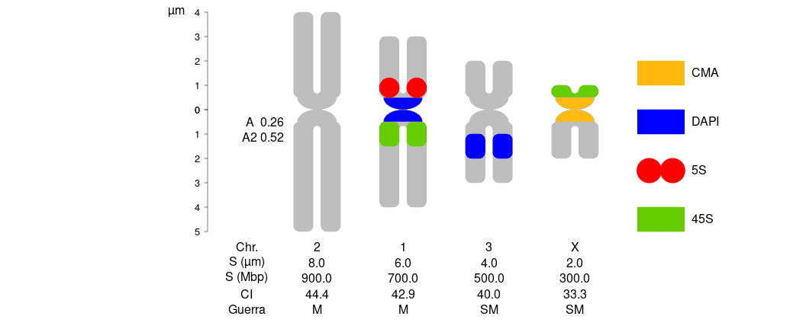
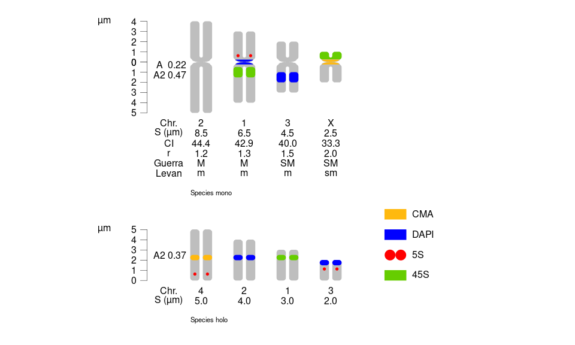
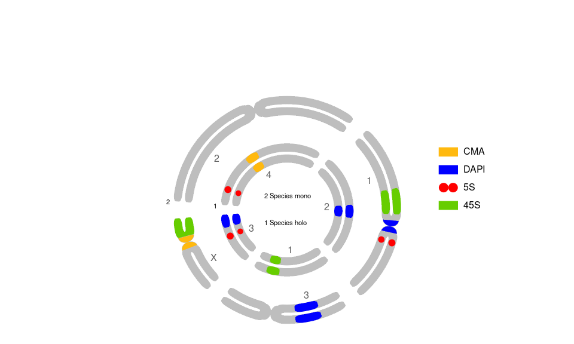

idiogramFISH
================

<!-- README.md is generated from README.Rmd. Please edit that file -->


# Shiny App. Idiograms with Marks and Karyotype Indices<br></br><br></br><br></br><br></br>

 [](https://ferroao.gitlab.io/idiogramfishhelppages/downloads.png) [](https://doi.org/10.5281/zenodo.3579417)
 
<br></br><br></br><a href='https://ko-fi.com/X7X71PZZG' target='_blank'></a>
<!-- badges: end -->

The goal of idiogramFISH is to plot idiograms of karyotypes, plasmids
and circ. chr. having a set of data.frames for chromosome data and
optionally marks’ data (`plotIdiograms` function) ([Roa and PC Telles,
2021](#ref-Roa2021)). Idiograms can also be plotted in concentric
circles. Separated chromatids can be visible when not in a circular
plot.<br> <br>Six styles of marks are available: square (squareLeft),
dots, cM (cMLeft), cenStyle, upArrow (downArrow), exProtein (inProtein);
its legend (label) can be drawn inline or to the right of karyotypes.
Three styles of centromere are available: rounded, triangular and
internal (inProtein). It is possible to calculate also chromosome and
karyotype indexes ([Romero-Zarco, 1986](#ref-Zarco1986new); [Watanabe
*et al.*, 1999](#ref-Watanabe1999)) and classify chromosome morphology
in the categories of Levan ([1964](#ref-Levan1964)), and
[Guerra](https://ferroao.gitlab.io/guerra1986/Guerra1986.pdf)
([1986](#ref-Guerra1986d)).

IdiogramFISH was written in R ([R Core Team, 2019](#ref-R-base)) and
also uses crayon ([Csárdi, 2017](#ref-R-crayon)), tidyr ([Wickham and
Henry, 2020](#ref-R-tidyr)), plyr ([Wickham, 2011](#ref-plyr2011)) and
dplyr packages ([Wickham *et al.*, 2019a](#ref-R-dplyr)). Documentation
was written with R-packages roxygen2 ([Wickham *et al.*,
2018](#ref-R-roxygen2)), usethis ([Wickham and Bryan,
2019](#ref-R-usethis)), bookdown ([Xie, 2016](#ref-bookdown2016)), knitr
([Xie, 2015](#ref-Xie2015)), pkgdown ([Wickham and Hesselberth,
2019](#ref-R-pkgdown)), Rmarkdown ([Xie *et al.*,
2018](#ref-rmarkdown2018)), rvcheck ([Yu, 2019a](#ref-R-rvcheck)),
badger ([Yu, 2019b](#ref-R-badger)), kableExtra ([Zhu,
2019](#ref-R-kableExtra)), rmdformats ([Barnier,
2020](#ref-R-rmdformats)) and RCurl ([Temple Lang and CRAN team,
2019](#ref-R-RCurl)). For some vignette figures, packages rentrez
([Winter, 2017](#ref-rentrez2017)), phytools ([Revell,
2012](#ref-phytools2012)), ggtree ([Yu *et al.*,
2018](#ref-ggtree2018)), ggplot2 ([Wickham, 2016](#ref-ggplot22016)) and
ggpubr ([Kassambara, 2019](#ref-R-ggpubr)) were used.

In addition, the shiny app `runBoard()` uses shiny ([Chang *et al.*,
2021](#ref-R-shiny)), shinydashboard ([Chang and Borges Ribeiro,
2018](#ref-R-shinydashboard)), rhandsontable ([Owen,
2018](#ref-R-rhandsontable)), gtools ([Warnes *et al.*,
2020](#ref-R-gtools)), rclipboard ([Bihorel, 2021](#ref-R-rclipboard))
and bib2df ([Ottolinger, 2019](#ref-R-bib2df)).

<!-- badger -->

## Installation

#### You can install idiogramFISH from [CRAN](https://cran.r-project.org/package=idiogramFISH) with:

``` r
install.packages("idiogramFISH")
```

Windows users: To avoid installation of packages in OneDrive

``` r
.libPaths("D:R/lib") # or any folder
.libPaths()
```

Or something in the line of
[this](https://answers.microsoft.com/en-us/windows/forum/all/removing-onedrive-from-default-filefolder-location/7d3c0dd0-3af5-414a-adf4-364dc28f3148?auth=1)

#### Devel. version of idiogramFISH

##### From gitlab with devtools ([Wickham *et al.*, 2019b](#ref-R-devtools))

Attention windows users, please install
[Rtools](https://cran.r-project.org/bin/windows/Rtools/) and
[git](https://git-scm.com/download/win) (compilation tools).

Vignettes (optional) use a lua filter, so you would need
<a href="https://pandoc.org/installing.html" target="_blank">pandoc</a>
ver. &gt; 2. and `pandoc-citeproc` or `citeproc`. RStudio comes with
pandoc. `rmarkdown::pandoc_version()`

``` r
# This installs package devtools, necessary for installing the dev version
install.packages("devtools")

url <- "https://gitlab.com/ferroao/idiogramFISH"

# Packages for vignettes: (optional)
list.of.packages <- c(
    "knitr",
    "kableExtra",
    "rmdformats",
    "rmarkdown",
    "RCurl",
    "rvcheck",
    "badger",
    "rentrez"
    )
new.packages <- list.of.packages[!(list.of.packages %in% installed.packages()[,"Package"])]
if(length(new.packages)) install.packages(new.packages)

# Linux with vignettes and Windows
devtools::install_git(url = url,build_vignettes = TRUE, force=TRUE)

# Mac with vignettes
devtools::install_git(url = url, build_opts=c("--no-resave-data","--no-manual") )
```

##### Installing in system terminal

``` r
# clone repository:
git clone "https://gitlab.com/ferroao/idiogramFISH"

R CMD build idiogramFISH
# install
R CMD INSTALL idiogramFISH_*.tar.gz
```

#### Releases

[News](https://gitlab.com/ferroao/idiogramFISH/blob/master/NEWS.md)

[CRAN
archive](https://cran.r-project.org/src/contrib/Archive/idiogramFISH/)

[Download
history](https://ferroao.gitlab.io/idiogramfishhelppages/downloads.png)

## Need help?

#### Manual in Bookdown style

 [](https://ferroao.gitlab.io/manualidiogramfish/)

#### Documentation in Pkgdown style

 [](https://ferroao.gitlab.io/idiogramFISH)

#### Vignettes:

Online:

 [](https://ferroao.gitlab.io/idiogramfishhelppages)

Launch vignettes from R for the installed version:

``` r
library(idiogramFISH)
packageVersion("idiogramFISH")
browseVignettes("idiogramFISH")
```

## Citation

To cite idiogramFISH in publications, please use:

Roa F, Telles MPC (2021) idiogramFISH: Shiny app. Idiograms with Marks
and Karyotype Indices, Universidade Federal de Goiás. Brazil. R-package.
version 2.0.2 <https://ferroao.gitlab.io/manualidiogramfish/>.
doi:<!-- breaklink -->10.5281/zenodo.3579417

To write citation to file:

``` r
sink("idiogramFISH.bib")
toBibtex(citation("idiogramFISH"))
sink()
```

## Authors

[Fernando Roa](https://ferroao.gitlab.io/curriculumpu/)  
[Mariana PC Telles](http://lattes.cnpq.br/4648436798023532)

# Shiny App

``` r
library(idiogramFISH)
runBoard()
```


# Basic examples

#### 1 How to plot a karyotype:

Define your plotting window size with something like `par(pin=c(10,6))`,
or with `svg()`, `png()`, etc. Add chromosome morphology according to
[Guerra](https://ferroao.gitlab.io/guerra1986/Guerra1986.pdf)
([1986](#ref-Guerra1986d)) or ([Levan *et al.*, 1964](#ref-Levan1964))

``` r
library(idiogramFISH)

data(dfOfChrSize) # chromsome data
data(dfMarkColor) # mark general data
data(dfOfMarks2)  # mark position data (inc. cen.)

dfOfMarks2[which(dfOfMarks2$markName=="5S"),]$markSize<-0.8 # modif. of mark size

# column Mbp not for plotting purposes
dfOfChrSize$Mbp<-(dfOfChrSize$shortArmSize+dfOfChrSize$longArmSize)*100

opar <- par(no.readonly = TRUE)      # make a copy of current settings if you want to restore them later
#par(opar) # recover par

par(mar=rep(0,4))

plotIdiograms(dfChrSize=dfOfChrSize,    # data.frame of chr. size
              dfMarkColor=dfMarkColor,  # d.f of mark style <- Optional
              dfMarkPos=dfOfMarks2,     # df of mark positions (includes cen. marks)
              
              karHeight=5,              # kar. height
              chrWidth = 1.2,           # chr. width
              chrSpacing = 1,           # space among chr.
              
              morpho="Guerra",          # chr. morpho. classif. (Guerra, Levan, both, "" ) ver. >= 1.12 only
              chrIndex="CI",            # cen. pos. (CI, AR, both, "" ) ver. >= 1.12 only
              chrSize = TRUE,           # add chr. sizes under chr.
              chrSizeMbp = TRUE,        # add Mbp sizes under chr. (see above)
              
              rulerPos= 0,              # position of ruler
              ruler.tck=-0.01,          # size and orientation of ruler ticks
              rulerNumberSize=.8        # font size of rulers
              ,xPosRulerTitle = 3             # ruler units (title) pos.
              
              ,legendWidth=1            # width of legend items
              ,fixCenBorder = TRUE      # use chrColor as border color of cen. or cen. marks
              ,distTextChr = 1.2        # chr. text separation
              
              ,xlimLeftMod = 2          # xlim left param.
              ,ylimBotMod = 0           # modify ylim bottom argument
              ,ylimTopMod = 0           # modify ylim top argument
); # dev.off() # close svg()
```



#### Let’s explore the data.frames for monocentrics:

    dfOfChrSize

<table>
<thead>
<tr>
<th style="text-align:left;">
chrName
</th>
<th style="text-align:right;">
shortArmSize
</th>
<th style="text-align:right;">
longArmSize
</th>
<th style="text-align:right;">
Mbp
</th>
</tr>
</thead>
<tbody>
<tr>
<td style="text-align:left;">
1
</td>
<td style="text-align:right;">
3
</td>
<td style="text-align:right;">
4
</td>
<td style="text-align:right;">
700
</td>
</tr>
<tr>
<td style="text-align:left;">
2
</td>
<td style="text-align:right;">
4
</td>
<td style="text-align:right;">
5
</td>
<td style="text-align:right;">
900
</td>
</tr>
<tr>
<td style="text-align:left;">
3
</td>
<td style="text-align:right;">
2
</td>
<td style="text-align:right;">
3
</td>
<td style="text-align:right;">
500
</td>
</tr>
<tr>
<td style="text-align:left;">
X
</td>
<td style="text-align:right;">
1
</td>
<td style="text-align:right;">
2
</td>
<td style="text-align:right;">
300
</td>
</tr>
</tbody>
</table>

    dfMarkColor

<table>
<thead>
<tr>
<th style="text-align:left;">
markName
</th>
<th style="text-align:left;">
markColor
</th>
<th style="text-align:left;">
style
</th>
</tr>
</thead>
<tbody>
<tr>
<td style="text-align:left;">
5S
</td>
<td style="text-align:left;">
red
</td>
<td style="text-align:left;">
dots
</td>
</tr>
<tr>
<td style="text-align:left;">
45S
</td>
<td style="text-align:left;">
chartreuse3
</td>
<td style="text-align:left;">
square
</td>
</tr>
<tr>
<td style="text-align:left;">
DAPI
</td>
<td style="text-align:left;">
blue
</td>
<td style="text-align:left;">
square
</td>
</tr>
<tr>
<td style="text-align:left;">
CMA
</td>
<td style="text-align:left;">
darkgoldenrod1
</td>
<td style="text-align:left;">
square
</td>
</tr>
</tbody>
</table>

`p, q` and `w` marks can have empty columns `markDistCen` and `markSize`
since v. 1.9.1 to plot whole arms (`p`, `q`) and whole chr. `w`.

    dfOfMarks2

<table>
<thead>
<tr>
<th style="text-align:left;">
chrName
</th>
<th style="text-align:left;">
markName
</th>
<th style="text-align:left;">
chrRegion
</th>
<th style="text-align:right;">
markSize
</th>
<th style="text-align:right;">
markDistCen
</th>
</tr>
</thead>
<tbody>
<tr>
<td style="text-align:left;">
1
</td>
<td style="text-align:left;">
5S
</td>
<td style="text-align:left;">
p
</td>
<td style="text-align:right;">
0.8
</td>
<td style="text-align:right;">
0.5
</td>
</tr>
<tr>
<td style="text-align:left;">
1
</td>
<td style="text-align:left;">
45S
</td>
<td style="text-align:left;">
q
</td>
<td style="text-align:right;">
1.0
</td>
<td style="text-align:right;">
0.5
</td>
</tr>
<tr>
<td style="text-align:left;">
X
</td>
<td style="text-align:left;">
45S
</td>
<td style="text-align:left;">
p
</td>
<td style="text-align:right;">
NA
</td>
<td style="text-align:right;">
NA
</td>
</tr>
<tr>
<td style="text-align:left;">
3
</td>
<td style="text-align:left;">
DAPI
</td>
<td style="text-align:left;">
q
</td>
<td style="text-align:right;">
1.0
</td>
<td style="text-align:right;">
1.0
</td>
</tr>
<tr>
<td style="text-align:left;">
1
</td>
<td style="text-align:left;">
DAPI
</td>
<td style="text-align:left;">
cen
</td>
<td style="text-align:right;">
NA
</td>
<td style="text-align:right;">
NA
</td>
</tr>
<tr>
<td style="text-align:left;">
X
</td>
<td style="text-align:left;">
CMA
</td>
<td style="text-align:left;">
cen
</td>
<td style="text-align:right;">
NA
</td>
<td style="text-align:right;">
NA
</td>
</tr>
</tbody>
</table>

#### 2 How to plot a karyotype of holocentrics:

``` r
library(idiogramFISH)

# column Mbp not for plotting purposes
dfChrSizeHolo$Mbp<-dfChrSizeHolo$chrSize*100

# svg("testing.svg",width=14,height=8 )
par(mar = c(0, 0, 0, 0), omi=rep(0,4) )

plotIdiograms(dfChrSize  =dfChrSizeHolo, # data.frame of chr. size
              dfMarkColor=dfMarkColor,   # df of mark style
              dfMarkPos  =dfMarkPosHolo, # df of mark positions
              
              addOTUName=FALSE,        # do not add OTU names
              distTextChr = 1,         # chr. name distance to chr.
              chrSize = TRUE,          # show chr. size under chr.
              chrSizeMbp = TRUE,       # show chr. size in Mbp under chr. requires Mbp column
              
              rulerPos=-.4,            # position of ruler
              rulerNumberPos=.9,       # position of numbers of rulers
              xPosRulerTitle= 4.5            # ruler units (title) horizon. pos. 
              
              ,xlimLeftMod=2           # modify xlim left argument of plot
              ,ylimBotMod=.2           # modify ylim bottom argument of plot
              ,legendHeight=.5         # height of legend labels
              ,legendWidth = 1.2       # width of legend labels
              ,xModifier = 20        # separ. among chromatids
); # dev.off() # close svg()
```


#### Let’s explore the data.frames for holocentrics:

    dfChrSizeHolo

<table>
<thead>
<tr>
<th style="text-align:right;">
chrName
</th>
<th style="text-align:right;">
chrSize
</th>
<th style="text-align:right;">
Mbp
</th>
<th style="text-align:left;">
OTU
</th>
</tr>
</thead>
<tbody>
<tr>
<td style="text-align:right;">
1
</td>
<td style="text-align:right;">
3
</td>
<td style="text-align:right;">
300
</td>
<td style="text-align:left;">
Species holo
</td>
</tr>
<tr>
<td style="text-align:right;">
2
</td>
<td style="text-align:right;">
4
</td>
<td style="text-align:right;">
400
</td>
<td style="text-align:left;">
Species holo
</td>
</tr>
<tr>
<td style="text-align:right;">
3
</td>
<td style="text-align:right;">
2
</td>
<td style="text-align:right;">
200
</td>
<td style="text-align:left;">
Species holo
</td>
</tr>
<tr>
<td style="text-align:right;">
4
</td>
<td style="text-align:right;">
5
</td>
<td style="text-align:right;">
500
</td>
<td style="text-align:left;">
Species holo
</td>
</tr>
</tbody>
</table>

    dfMarkColor

<table>
<thead>
<tr>
<th style="text-align:left;">
markName
</th>
<th style="text-align:left;">
markColor
</th>
<th style="text-align:left;">
style
</th>
</tr>
</thead>
<tbody>
<tr>
<td style="text-align:left;">
5S
</td>
<td style="text-align:left;">
red
</td>
<td style="text-align:left;">
dots
</td>
</tr>
<tr>
<td style="text-align:left;">
45S
</td>
<td style="text-align:left;">
chartreuse3
</td>
<td style="text-align:left;">
square
</td>
</tr>
<tr>
<td style="text-align:left;">
DAPI
</td>
<td style="text-align:left;">
blue
</td>
<td style="text-align:left;">
square
</td>
</tr>
<tr>
<td style="text-align:left;">
CMA
</td>
<td style="text-align:left;">
darkgoldenrod1
</td>
<td style="text-align:left;">
square
</td>
</tr>
</tbody>
</table>

    dfMarkPosHolo

<table>
<thead>
<tr>
<th style="text-align:right;">
chrName
</th>
<th style="text-align:left;">
markName
</th>
<th style="text-align:right;">
markPos
</th>
<th style="text-align:right;">
markSize
</th>
<th style="text-align:left;">
OTU
</th>
</tr>
</thead>
<tbody>
<tr>
<td style="text-align:right;">
3
</td>
<td style="text-align:left;">
5S
</td>
<td style="text-align:right;">
1.0
</td>
<td style="text-align:right;">
0.5
</td>
<td style="text-align:left;">
Species holo
</td>
</tr>
<tr>
<td style="text-align:right;">
3
</td>
<td style="text-align:left;">
DAPI
</td>
<td style="text-align:right;">
1.5
</td>
<td style="text-align:right;">
0.5
</td>
<td style="text-align:left;">
Species holo
</td>
</tr>
<tr>
<td style="text-align:right;">
1
</td>
<td style="text-align:left;">
45S
</td>
<td style="text-align:right;">
2.0
</td>
<td style="text-align:right;">
0.5
</td>
<td style="text-align:left;">
Species holo
</td>
</tr>
<tr>
<td style="text-align:right;">
2
</td>
<td style="text-align:left;">
DAPI
</td>
<td style="text-align:right;">
2.0
</td>
<td style="text-align:right;">
0.5
</td>
<td style="text-align:left;">
Species holo
</td>
</tr>
<tr>
<td style="text-align:right;">
4
</td>
<td style="text-align:left;">
CMA
</td>
<td style="text-align:right;">
2.0
</td>
<td style="text-align:right;">
0.5
</td>
<td style="text-align:left;">
Species holo
</td>
</tr>
<tr>
<td style="text-align:right;">
4
</td>
<td style="text-align:left;">
5S
</td>
<td style="text-align:right;">
0.5
</td>
<td style="text-align:right;">
0.5
</td>
<td style="text-align:left;">
Species holo
</td>
</tr>
</tbody>
</table>

#### 3. Plotting both mono. and holo.

See vignettes for a circular version.

Merge data.frames with plyr ([Wickham, 2011](#ref-plyr2011))

``` r
# chromsome data, if only 1 species, column OTU is optional
require(plyr)
dfOfChrSize$OTU   <- "Species mono"
dfChrSizeHolo$OTU <- "Species holo"
 
monoholoCS <- plyr::rbind.fill(dfOfChrSize,dfChrSizeHolo)

dfOfMarks2$OTU     <-"Species mono"
dfMarkPosHolo$OTU <-"Species holo"

monoholoMarks <- plyr::rbind.fill(dfOfMarks2,dfMarkPosHolo)
monoholoMarks[which(monoholoMarks$markName=="5S"),]$markSize<-.5
monoholoMarks
   chrName markName chrRegion markSize markDistCen          OTU markPos
1        1       5S         p      0.5         0.5 Species mono      NA
2        1      45S         q      1.0         0.5 Species mono      NA
3        X      45S         p       NA          NA Species mono      NA
4        3     DAPI         q      1.0         1.0 Species mono      NA
5        1     DAPI       cen       NA          NA Species mono      NA
6        X      CMA       cen       NA          NA Species mono      NA
7        3       5S      <NA>      0.5          NA Species holo     1.0
8        3     DAPI      <NA>      0.5          NA Species holo     1.5
9        1      45S      <NA>      0.5          NA Species holo     2.0
10       2     DAPI      <NA>      0.5          NA Species holo     2.0
11       4      CMA      <NA>      0.5          NA Species holo     2.0
12       4       5S      <NA>      0.5          NA Species holo     0.5
```

``` r
library(idiogramFISH)

# svg("testing.svg",width=10,height=6 )
par(mar=rep(0,4))
plotIdiograms(dfChrSize  = monoholoCS,   # data.frame of chr. size
              dfMarkColor= dfMarkColor,  # df of mark style
              dfMarkPos  = monoholoMarks,# df of mark positions, includes cen. marks
              
              chrSize = TRUE,            # show chr. size under chr.
              
              squareness = 4,            # vertices squareness
              roundedCen = FALSE,        # triangular cen.
              addOTUName = TRUE,         # add OTU names
              OTUTextSize = .7,          # font size of OTU
              distTextChr = 0.7,         # separ. among chr. and text and among chr. name and indices
              
              karHeiSpace = 4,           # karyotype height inc. spacing
              karIndexPos = .2,          # move karyotype index
              
              legendHeight= 1,           # height of legend labels
              legendWidth = 1,           # width of legend labels
              fixCenBorder = TRUE,       # use chrColor as border color of cen. or cen. marks
              
              rulerPos= 0,               # position of ruler
              ruler.tck=-0.02,           # size and orientation of ruler ticks
              rulerNumberPos=.9,         # position of numbers of rulers
              xPosRulerTitle= 4,               # ruler units (title) pos.
              
              xlimLeftMod=1,             # modify xlim left argument of plot
              xlimRightMod=3,            # modify xlim right argument of plot
              ylimBotMod= .2             # modify ylim bottom argument of plot
              
              ,chromatids=FALSE          # do not show separ. chromatids
              
              # for Circular Plot, add:
              
              # ,useOneDot=TRUE
              
              # ,circularPlot = TRUE       # circularPlot
              # ,shrinkFactor = .9         # percentage 1 = 100% of circle with chr.
              # ,circleCenter = 3          # X coordinate of circleCenter (affects legend pos.)
              # ,chrLabelSpacing = .9      # chr. names spacing
              
              # ,OTUsrt = 0                # angle for OTU name (or number)
              # ,OTUplacing = "number"     # Use number and legend instead of name
              # ,OTULabelSpacerx = -0.6    # modify position of OTU label, when OTUplacing="number" or "simple"
              # ,OTUlegendHeight = 1.5     # space among OTU names when in legend - OTUplacing
              # ,separFactor = 0.75        # alter separ. of kar.
); # dev.off() # close svg()
```





## References

<div id="refs_normal">

<div id="ref-Guerra1986d" class="csl-entry">

Guerra M. 1986. <span class="nocase">Reviewing the chromosome
nomenclature of Levan et al.</span> *Brazilian Journal of Genetics*,
9(4): 741–743

</div>

<div id="ref-Levan1964" class="csl-entry">

Levan A, Fredga K, Sandberg AA. 1964. <span class="nocase">Nomenclature
for centromeric position on chromosomes</span> *Hereditas*, 52(2):
201–220. <https://doi.org/10.1111/j.1601-5223.1964.tb01953.x>.
<https://onlinelibrary.wiley.com/doi/abs/10.1111/j.1601-5223.1964.tb01953.x>

</div>

<div id="ref-Zarco1986new" class="csl-entry">

Romero-Zarco C. 1986. <span class="nocase">A new method for estimating
karyotype asymmetry</span> *Taxon*, 35(3): 526–530.
<https://onlinelibrary.wiley.com/doi/abs/10.2307/1221906>

</div>

<div id="ref-Watanabe1999" class="csl-entry">

Watanabe K, Yahara T, Denda T, Kosuge K. 1999. <span
class="nocase">Chromosomal evolution in the genus Brachyscome
(Asteraceae, Astereae): statistical tests regarding correlation between
changes in karyotype and habit using phylogenetic information</span>
*Journal of Plant Research*, 112: 145–161.
<https://link.springer.com/article/10.1007/PL00013869>

</div>

</div>

## R-packages

<div id="refs_software">

<div id="ref-R-crayon" class="csl-entry">

Csárdi G. 2017. *Crayon: Colored terminal output*. R package version
1.3.4. <https://CRAN.R-project.org/package=crayon>

</div>

<div id="ref-R-ggpubr" class="csl-entry">

Kassambara A. 2019. *Ggpubr: ’ggplot2’ based publication ready plots*. R
package version 0.2.3. <https://CRAN.R-project.org/package=ggpubr>

</div>

<div id="ref-R-base" class="csl-entry">

R Core Team. 2019. *R: A language and environment for statistical
computing* R Foundation for Statistical Computing, Vienna, Austria.
<https://www.R-project.org/>

</div>

<div id="ref-phytools2012" class="csl-entry">

Revell LJ. 2012. Phytools: An r package for phylogenetic comparative
biology (and other things). *Methods in Ecology and Evolution*, 3:
217–223.
<https://besjournals.onlinelibrary.wiley.com/doi/10.1111/j.2041-210X.2011.00169.x>

</div>

<div id="ref-Roa2021" class="csl-entry">

Roa F, PC Telles M. 2021. *<span class="nocase">idiogramFISH</span>:
Shiny app. Idiograms with marks and karyotype indices* Universidade
Federal de Goiás, UFG, Goiânia. R-package. version 2.0.0.
<https://doi.org/10.5281/zenodo.3579417>.
<https://ferroao.gitlab.io/manualidiogramfish/>

</div>

<div id="ref-plyr2011" class="csl-entry">

Wickham H. 2011. The split-apply-combine strategy for data analysis
*Journal of Statistical Software*, 40(1): 1–29.
<https://www.jstatsoft.org/article/view/v040i01>

</div>

<div id="ref-ggplot22016" class="csl-entry">

Wickham H. 2016. *ggplot2: Elegant graphics for data analysis*
Springer-Verlag New York. <https://ggplot2.tidyverse.org>

</div>

<div id="ref-R-dplyr" class="csl-entry">

Wickham H, François R, Henry L, Müller K. 2019a. *Dplyr: A grammar of
data manipulation*. R package version 0.8.3.
<https://CRAN.R-project.org/package=dplyr>

</div>

<div id="ref-R-tidyr" class="csl-entry">

Wickham H, Henry L. 2020. *Tidyr: Tidy messy data*. R package version
1.0.2. <https://CRAN.R-project.org/package=tidyr>

</div>

<div id="ref-R-devtools" class="csl-entry">

Wickham H, Hester J, Chang W. 2019b. *Devtools: Tools to make developing
r packages easier*. R package version 2.2.1.
<https://CRAN.R-project.org/package=devtools>

</div>

<div id="ref-rentrez2017" class="csl-entry">

Winter DJ. 2017. <span class="nocase">rentrez</span>: An r package for
the NCBI eUtils API *The R Journal*, 9: 520–526

</div>

<div id="ref-ggtree2018" class="csl-entry">

Yu G, Lam TT-Y, Zhu H, Guan Y. 2018. Two methods for mapping and
visualizing associated data on phylogeny using ggtree. *Molecular
Biology and Evolution*, 35: 3041–3043.
<https://doi.org/10.1093/molbev/msy194>.
<https://academic.oup.com/mbe/article/35/12/3041/5142656>

</div>

</div>

## Shiny App

<div id="refs_shiny">

<div id="ref-R-rclipboard" class="csl-entry">

Bihorel S. 2021. *Rclipboard: Shiny/r wrapper for clipboard.js*. R
package version 0.1.3. <https://github.com/sbihorel/rclipboard/>

</div>

<div id="ref-R-shinydashboard" class="csl-entry">

Chang W, Borges Ribeiro B. 2018. *Shinydashboard: Create dashboards with
shiny*. R package version 0.7.1.
<http://rstudio.github.io/shinydashboard/>

</div>

<div id="ref-R-shiny" class="csl-entry">

Chang W, Cheng J, Allaire J, Sievert C, Schloerke B, Xie Y, Allen J,
McPherson J, Dipert A, Borges B. 2021. *Shiny: Web application framework
for r*. R package version 1.6.0. <https://shiny.rstudio.com/>

</div>

<div id="ref-R-bib2df" class="csl-entry">

Ottolinger P. 2019. *bib2df: Parse a BibTeX file to a data frame*. R
package version 1.1.1. <https://github.com/ropensci/bib2df>

</div>

<div id="ref-R-rhandsontable" class="csl-entry">

Owen J. 2018. *Rhandsontable: Interface to the handsontable.js library*.
R package version 0.3.7. <http://jrowen.github.io/rhandsontable/>

</div>

<div id="ref-R-gtools" class="csl-entry">

Warnes GR, Bolker B, Lumley T. 2020. *Gtools: Various r programming
tools*. R package version 3.8.2. <https://github.com/r-gregmisc/gtools>

</div>

</div>

## Documentation

<div id="refs_docs">

<div id="ref-R-rmdformats" class="csl-entry">

Barnier J. 2020. *Rmdformats: HTML output formats and templates for
’rmarkdown’ documents*. R package version 0.3.7.
<https://CRAN.R-project.org/package=rmdformats>

</div>

<div id="ref-R-RCurl" class="csl-entry">

Temple Lang D, CRAN team the. 2019. *RCurl: General network
(HTTP/FTP/...) Client interface for r*. R package version 1.95-4.12.
<https://CRAN.R-project.org/package=RCurl>

</div>

<div id="ref-R-usethis" class="csl-entry">

Wickham H, Bryan J. 2019. *Usethis: Automate package and project setup*.
R package version 1.5.1. <https://CRAN.R-project.org/package=usethis>

</div>

<div id="ref-R-roxygen2" class="csl-entry">

Wickham H, Danenberg P, Eugster M. 2018. *roxygen2: In-line
documentation for r*. R package version 6.1.1.
<https://CRAN.R-project.org/package=roxygen2>

</div>

<div id="ref-R-pkgdown" class="csl-entry">

Wickham H, Hesselberth J. 2019. *Pkgdown: Make static HTML documentation
for a package*. R package version 1.4.1.
<https://CRAN.R-project.org/package=pkgdown>

</div>

<div id="ref-Xie2015" class="csl-entry">

Xie Y. 2015. *Dynamic documents with R and knitr* Chapman; Hall/CRC,
Boca Raton, Florida. ISBN 978-1498716963. <https://yihui.org/knitr/>

</div>

<div id="ref-bookdown2016" class="csl-entry">

Xie Y. 2016. *Bookdown: Authoring books and technical documents with R
markdown* Chapman; Hall/CRC, Boca Raton, Florida. ISBN 978-1138700109.
<https://github.com/rstudio/bookdown>

</div>

<div id="ref-rmarkdown2018" class="csl-entry">

Xie Y, Allaire JJ, Grolemund G. 2018. *R markdown: The definitive guide*
Chapman; Hall/CRC, Boca Raton, Florida. ISBN 9781138359338.
<https://bookdown.org/yihui/rmarkdown>

</div>

<div id="ref-R-badger" class="csl-entry">

Yu G. 2019b. *Badger: Badge for r package*. R package version 0.0.6.
<https://CRAN.R-project.org/package=badger>

</div>

<div id="ref-R-rvcheck" class="csl-entry">

Yu G. 2019a. *Rvcheck: R/package version check*. R package version
0.1.6. <https://CRAN.R-project.org/package=rvcheck>

</div>

<div id="ref-R-kableExtra" class="csl-entry">

Zhu H. 2019. *kableExtra: Construct complex table with ’kable’ and pipe
syntax*. R package version 1.1.0.
<https://CRAN.R-project.org/package=kableExtra>

</div>

</div>
