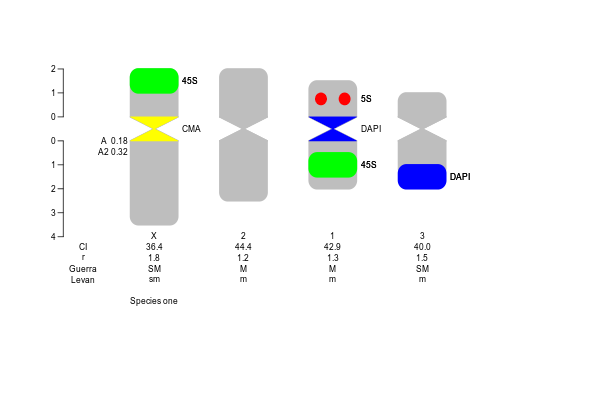
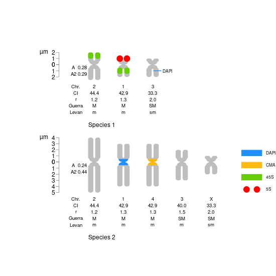
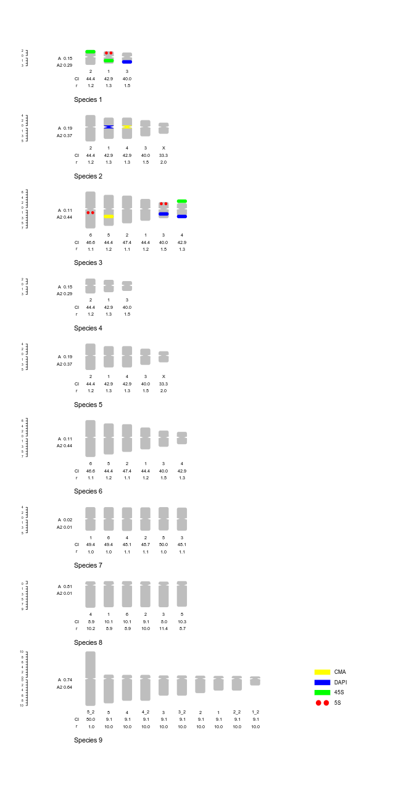

``` {r, results="asis", echo=FALSE, message=FALSE}
# <!-- pkgdown --> 
# <!-- jquery --><script src="jquery.min.js" crossorigin="anonymous"></script>
myfile<-"jquery.min.js"
if(file.exists(myfile)){
cat(paste0('<script src="',myfile,'" crossorigin="anonymous"></script> <!-- # -->'))
}
# <!-- clipboard.js --><script src="clipboard.min.js"  crossorigin="anonymous"></script>
myfile<-"clipboard.min.js"
if(file.exists(myfile)){
cat(paste0('<script src="',myfile,'"crossorigin="anonymous"></script>'))
}
# <!-- Font Awesome icons --><link rel="stylesheet" href="all.minMod.css"  crossorigin="anonymous">
myfile<-"all.minMod.css"
if(file.exists(myfile)){
cat(paste0('<link rel="stylesheet" href="',myfile,'"  crossorigin="anonymous">'))
}
# <!-- Bootstrap --><link rel="stylesheet" href="bootstrap.minO.css" crossorigin="anonymous">
myfile<-"bootstrap.minO.css"
if(file.exists(myfile)){
cat(paste0('<link rel="stylesheet" href="',myfile,'"  crossorigin="anonymous">'))
}
# <!-- # <script src="bootstrap.min.js"  crossorigin="anonymous"></script> -->
myfile<-"bootstrap.min.js"
if(file.exists(myfile)){
cat(paste0('<script src="',myfile,'" crossorigin="anonymous"></script> <!-- # -->'))
}
myfile<-"pkgdown2.js"
if(file.exists(myfile)){
cat(paste0('<script src="',myfile,'"></script> <!-- # -->'))
}
```
<link rel="stylesheet" href="mystyle.css">

<div class="goright">
Go to [home](index.html)  
Go to [2. holocentrics Vignette](BplotIdiogramsHoloVig.html)  
Go to [3. groups Vignette](CgroupsVig.html)  
Go to [4. phylogeny Vignette](DphylogenyVig.html)  
Go to [5. human Vignette](EhumanVig.html)    
<!-- # there are 2 spaces at the end of those lines -->
</div>

This guide shows the files to plot idiograms of measured karyotypes and optionally marks. 

# Load package

visit gitlab for installation instructions https://gitlab.com/ferroao/idiogramFISH

```{r, results="hide", message=FALSE, warning=FALSE, eval=TRUE}

#load package
library(idiogramFISH) 
```

# Get your chromosome size data

Initially you have to open your chromosome data as a data.frame. 

## From scratch: {-}

```{r}
# Example data.frame to write in R, use: (column OTU is optional if only 1 OTU)
mydfChrSize<-read.table(text=
"            OTU chrName shortArmSize longArmSize 
  \"Species one\"   1     1.5         2.0  
  \"Species one\"   2     2.0         2.5  
  \"Species one\"   3     1.0         1.5
  \"Species one\"   B     2.0         3.5"  ,  header=TRUE, stringsAsFactors=FALSE,fill=TRUE)
```

<div class="verysmall">
```{r, echo=F}
# just to show it here
kableExtra::kable_styling(knitr::kable(mydfChrSize) , full_width = F
                           , font_size = 10)
```
</div>

## loading saved data: {-}

Initially, if you use RStudio, use menu "Session", "Set working directory" for choosing your desired folder or:
``` {r, eval=FALSE}
setwd("~/folder/subfolder")
```

Open your chromosome data data.frame importing it from a .csv (read.csv) or .xls file (readxl). 

``` {r, eval=FALSE}
mydfChrSize<-read.csv("somefile.csv")
```

Editing a data.frame:

``` {r, eval=FALSE}
bigdfOfChrSize <- edit(bigdfOfChrSize, edit.row.names = FALSE)
```

For fixing column names use:
``` {r, eval=FALSE}
colnames(mydfChrSize)<-c("OTU", "chrName","shortArmSize","longArmSize")
```

# Get marks general data

This data.frame is optional for ver. > 1.0.0

``` {r, eval=FALSE}
packageVersion("idiogramFISH")
```

Open or make your mark data as a data.frame. This data.frame has the marks present in all karyotypes without position info.
If `style` column is not present it will be filled with `square` during plotting.

```{r}
# From scratch:
mydfMarkColor<-read.table(text=
" markName markColor  style
        5S       red   dots
       45S     green square
      DAPI      blue square
       CMA    yellow square
\"B mark\"     black square"  ,  header=TRUE, stringsAsFactors=FALSE,fill=TRUE)
```

<div class="verysmall">
```{r, echo=F}
# just to show it here
kableExtra::kable_styling(knitr::kable(mydfMarkColor) , full_width = F
                           , font_size = 10
                          # , bootstrap_options = c("striped", "hover", "condensed") 
                          )
```
</div>

For fixing column names use:
``` {r, eval=FALSE}
colnames(mydfMarkColor)<-c("markName", "markColor","style") 
# if style column is not present it will be filled with "square"
```
# Get marks positions data

Open or write your mark positions as a data.frame. This data.frame has the marks present in all karyotypes with position info.
This data.frame has also the centromeric marks present in all karyotypes.

```{r}
# We will use column OTU if data.frame because chromosome size df has it
mydfOfMarks<-read.table(text=
"            OTU chrName markName chrRegion markSize markDistCen
\"Species one\"      1      45S       p       NA         NA     # no measure means whole arm
\"Species one\"      1       5S       q      0.5         0.5
\"Species one\"      B  \"B mark\"    w       NA         NA     # w for whole chromosome
\"Species one\"      2     45S        p        1         1.0
\"Species one\"      3     DAPI       q        1         1.0
\"Species one\"      1     DAPI       cen
\"Species one\"      3      CMA       cen", header=TRUE, stringsAsFactors=FALSE,fill=TRUE)
```

<div class="verysmall">
```{r, echo=F}
kableExtra::kable_styling(knitr::kable(mydfOfMarks) , full_width = F
                           , font_size = 10
                          , bootstrap_options = c("striped", "hover", "condensed")
                          )
```
</div>

For fixing column names use something like:
``` {r, eval=FALSE}
colnames(mydfMarkColor)<-c("OTU", "chrName","markName","chrRegion","markSize","markDistCen") 
```

# Add some text to the right

For ver. > 1.7

```{r}
# We will use column note to add a note to the right of the karyotype of the OTU in column OTU
notesdf<-read.table(text=
"            OTU    note
\"Species one\"   \"Author notes\"  ", header=TRUE, stringsAsFactors=FALSE,fill=TRUE)
```


# Plotting

You can plot without marks (use only 1st data.frame), but we will use all 4 data.frames created.
By default the function will calculate indices and morphological categories [@Guerra1986d;@Levan1964;@Zarco1986new;@Watanabe1999].
Use parameters of the function to modify that. See ?plotIdiograms

```{r example_M1, echo=TRUE, results="hide", fig.width=13, fig.height=8, message=FALSE, dev='png'}
# svg("mydfChrSize.svg",width=13,height=8 )
# png("mydfChrSize.png", width=600, height=400)

# par(mar = c(0, 0, 0, 0), omi=rep(0,4), oma=rep(0,4) )

plotIdiograms(dfChrSize= mydfChrSize,     # chr. size data.frame
              dfMarkPos= mydfOfMarks,     # mark position data.frame (inc. cen.)
              dfMarkColor=mydfMarkColor,  # mark style d.f.
              roundness=3,                # vertices roundness  
              distTextChr = .7,           # separation among text and chr names and ind.              
              orderBySize = FALSE,        # do not order chr. by size
              karHeiSpace=1.6,            # vertical size of karyotype including spacer
              
              legendWidth = .8            # legend item width
              ,legendHeight = .5          # legend item height
              ,markLabelSpacer = 2        # legend spacer
              
              ,rulerPos=-1,               # ruler position
              ruler.tck=-0.01,            # ticks of ruler size and orientation
              
              notes=notesdf               # data.frame with notes NEW
              ,notesTextSize = 1.3        # font size of notes
              ,notesPos = .2              # space from chr. (right) to note
              
              ,ylimBotMod = 0.4           # modify ylim bottom argument
              ,ylimTopMod = 0             # modify ylim top argument
              ,xlimLeftMod = 2            # modify left xlim
              ,xlimRightMod = 3           # modify right xlim
              ,asp=1                      # y x aspect ratio

)
# dev.off()
```
  
```{r, results="asis", comment=NA, echo=FALSE}
# cat(paste0("" ) )
# cat(paste0("" ) )
```

Vertices when `centromereSize=0` are rounded:

```{r example_M1cen0, echo=TRUE, results="hide", fig.width=7, fig.height=4.5, message=FALSE,dev='png'}

png("mydfChrSize2.png", width=700, height=950)
plotIdiograms(dfChrSize   = bigdfOfChrSize[1:14,],  # chr. size df
              dfMarkColor = mydfMarkColor,# mark style df
              dfMarkPos   = bigdfOfMarks, # mark position df
              
              # cen. marks NOT AVAILABLE for centromereSize = 0
              centromereSize = 0,         # <- HERE
              roundness=3,                # vertices roundness  
              chrSpacing = .7,            # space among chr.
              karHeight = 3,              # karyotype rel. height 
              karHeiSpace=5,              # vertical size of karyotype including spacer
              amoSepar= 2.5,              # separation among karyotype
              indexIdTextSize=.8,         # font size fo chr name and indices
              karIndexPos = .1,           # position of kar. index
              markLabelSize=.7,           # font size of mark legends
              distTextChr = .8,           # separation among chr. and ind.
              
              rulerPos=-.8,               # ruler position
              ruler.tck=-0.01,            # ticks of ruler size and orientation
              
              xlimLeftMod = 2,            # modify xlim left argument 
              ylimBotMod = 0.4,           # modify ylim bottom argument
              ylimTopMod = 0              # modify ylim top argument
              ,asp=1                      # y x aspect
)
dev.off()
```

```{r, results="asis", comment=NA, echo=FALSE}
cat(paste0("" ) )
```
  
For ver. > 1.0.0 there is no need to add `dfMarkColor` and you can also use the parameter
`mycolors` (optional too), to establish marks' colors. Colors are assigned depending on the order of marks, i.e.:

``` {r, eval=FALSE}
unique(c(dfOfMarks$markName,dfOfCenMarks$markName) )
```

``` {r, eval=FALSE, dev='svg'}

charVectorCol <- c("tomato3","darkolivegreen4","dfsd","blue","green")
png("dfOfChrSize.png", width=600, height=400)
par(mar=rep(0,4))

plotIdiograms(dfChrSize = dfOfChrSize,     # d.f. of chr. sizes
              dfMarkPos = dfOfMarks2,      # d.f. of marks' positions
              chrColor  = "gray",          # chr. color
              cenColor  = "gray",          # cen. color
              
              mycolors = charVectorCol,    # colors to use
              
              distTextChr = .5             # separ. text and chr.
              ,karHeiSpace=1.6,            # karyotype height including spacing
              markLabelSize=.7,            # font size for labels (legend)
              
              rulerPos=-.5,                # ruler position
              ruler.tck=-0.01,             # ruler tick orientation and length
              rulerNumberSize=.5           # ruler font size
              ,asp=1                       # y x aspect
              ,xlimRightMod = 1            # modify xlim right arg.
)
dev.off()
```


# Example with several species (OTUs)

To illustrate this, we will load some data.frames from the package 

* Chromosome sizes 

<div class="pre-scrollx">
```{r, eval=F}
head(bigdfOfChrSize,30)
```
</div>

<div class="verysmall">
```{r, echo=F}
kableExtra::kable_styling(knitr::kable(head(bigdfOfChrSize,30)) , full_width = F
                           , font_size = 10
                          , bootstrap_options = c("striped", "hover", "condensed"),
                 
) 
```
</div>

* Mark characteristics, does not require OTU 

<div class="nobullet">
* optional for ver. > 1.0.0
</div>

<div class="pre-scrollx">
```{r, width=45 }
data("dfMarkColor")
```
</div>

<div class="verysmall">
```{r, echo=F}
kableExtra::kable_styling(knitr::kable(dfMarkColor) , full_width = F
                           , font_size = 10
                          , bootstrap_options = c("striped", "hover", "condensed")
                          )
```
</div>

* Mark position

<div class="pre-scrollx">
```{r}
data("bigdfOfMarks")
```
</div>

<div class="verysmall">
```{r, echo=F}
kableExtra::kable_styling(knitr::kable(bigdfOfMarks) , full_width = F
                           , font_size = 10
                          , bootstrap_options = c("striped", "hover", "condensed")
                          )
```
</div>

## Plotting {-}

```{r example_M3, echo=TRUE, results="hide", fig.width=6, fig.height=13, message=FALSE, dev='png'}

# png("bigdfOfChrSize.png", width=650, height=1300)
plotIdiograms(dfChrSize  =bigdfOfChrSize,# chr sizes
              dfMarkColor=dfMarkColor,   # mark characteristics, optional in dev version. see above. 
              dfMarkPos  =bigdfOfMarks,  # mark positions (inc. cen. marks)
              # cen. marks in bigdfOfMarks

              karHeight=2.5,             # karyotype rel. height
              karHeiSpace=6,             # karyotype vertical size with spacing
              amoSepar = 2,              # Vertical separation of kar. when karSpear = TRUE
              
              centromereSize = 1,        # apparent size of cen.
              roundness = 10,            # roundness of chr. vertices
              distTextChr=.8,            # distance of chr. to text
              morpho=FALSE,              # add chr. morphology
              indexIdTextSize=.6,        # font size of indices and chr. name
              OTUTextSize=.9,            # font size of OTU names
              
              markLabelSize=.7,          # font size of legend
              legendHeight = 2,          # height of labels
              
              ruler=TRUE,                # add ruler
              rulerPos=-.9,              # position of ruler
              rulerPosMod=3,             # modify position of ruler
              ruler.tck=-0.004,          # size and orient. of ticks in ruler
              rulerNumberPos=.4,         # position of numbers of ruler
              rulerNumberSize=.4,        # font size of ruler

              xlimRightMod = 3,          # modify xlim left argument 
              ylimBotMod = 0,            # modify ylim bottom argument
              ylimTopMod = -.3           # modify ylim top argument
              ,asp=1                     # y x aspect ratio
)

# dev.off() # for png()
```
    
```{r, results="asis", comment=NA, echo=FALSE, eval=FALSE}
cat(paste0("" ) )
```


# GISH of monocentric chromosomes

You need the data.frame of chr. sizes, and a d.f. of marks 

## Chr. sizes: {-}

<div class="pre-scrollx">
```{r, comment=NA, echo=F}
cat(paste0("parentalAndHybChrSize" ) )
```
</div>

<div class="verysmall">
```{r, echo=F}
kableExtra::kable_styling(knitr::kable(parentalAndHybChrSize) , full_width = F
                           , font_size = 10)
```
</div>

## Marks' positions data  {-}

<div class="pre-scrollx">
```{r, comment=NA, echo=F}
cat(paste0("dfAlloParentMarks" ) )
```
</div>
<div class="verysmall">
```{r, echo=F}
kableExtra::kable_styling(knitr::kable(dfAlloParentMarks) , full_width = F
                           , font_size = 10
                          , bootstrap_options = c("striped", "hover", "condensed")
                          )
```
</div>

```{r}
# We will use column note to add a note to the right of the karyotype of the OTU in column OTU
notesdf2<-read.table(text=
"           OTU                note
\"Parental 1\"     \"Parental One\"  
\"Parental 2\"     \"Parental Two\"  
\"Allopolyploid\"  Allopolyploid  ", header=TRUE, stringsAsFactors=FALSE,fill=TRUE)
```

## Plotting {-}

```{r, echo=TRUE, results="hide", fig.width=7, fig.height=9, message=FALSE,dev='png'}

# svg("gish.svg",width=7,height=9 )
# png("mydfChrSize.png", width=700, height=900)
plotIdiograms(dfChrSize = parentalAndHybChrSize,  # d.f. of chr. sizes
              dfMarkPos = dfAlloParentMarks,      # d.f. of marks' positions
              cenColor  = NULL,            # cen. color 
              
              karHeiSpace=5,               # karyotype height including spacing
              karSepar = FALSE,            # equally sized (height) karyotypes
              
              rulerPos=-1.2,               # ruler position
              ruler.tck= -0.006,           # ruler tick orientation and length
              rulerNumberSize=.4           # ruler font size
              
              ,legend=""                   # no legend
              ,asp=1                       # y x aspect ratio
              
              ,notes=notesdf2              # data.frame with notes NEW
              ,notesTextSize = 1.3         # font size of notes
              ,notesPos = 1.5              # space from chr. (right) to note
              
              ,ylimBotMod = 1              # ylim bottom argument mod.
)
# dev.off()
```
  
# Plot data in micrometers and bases

For version > 1.9.1 info in number of bases can be combined in the same plot with info. in micrometers.

```{r, echo=TRUE, results="hide", fig.width=10, fig.height=14, message=FALSE,dev='png', warning=FALSE}

# merge data.frames in micrometers and number of bases
mixedThreeSpChrSize <- plyr::rbind.fill(bigdfOfChrSize[1:14,], bigdfOfChrSize3Mb)
# sort by OTU name
mixedThreeSpChrSize <- mixedThreeSpChrSize[order(mixedThreeSpChrSize$OTU),]
 
# merge marks in micrometers and bases
mixedThreeSpMarks <- plyr::rbind.fill(bigdfOfMarks , bigdfOfMarks3Mb)

plotIdiograms(dfChrSize   = mixedThreeSpChrSize,  # chr. size df
              dfMarkPos   = mixedThreeSpMarks,    # mark position df
              centromereSize = 1,         # cen. size
              amoSepar = 0.8,             # separ. among kar.
              
              roundness=5,                # vertices roundness
              
              chrWidth=.3,                # width of chr.
              chrSpacing = .3,            # space among chr.
              kerHeight=3,                # karyotype height without spacing
              karHeiSpace = 3.5,          # vertical size of karyotype including spacer
              indexIdTextSize=.7,         # font size fo chr name and indices
              markLabelSize=.7,           # font size of mark legends
              distTextChr = .55,          # separation among chr. names and indices
              
              legendWidth = 1.5           # legend items width
              ,ylabline = -7              # position of Mb (title) in axis               
              
              ,rulerPos=-.5,              # ruler position
              ruler.tck=-0.01,            # ticks of ruler size and orientation
              rulerNumberPos =.7,         # position of numbers in ruler
              rulerNumberSize=.5,         # font size of ruler numbers
              
              ylimBotMod = 0.4,           # modify ylim bottom argument
              ylimTopMod = 0              # modify ylim top argument
              ,asp=1                      # aspect of plot
)
```

Let's explore those data.frames

<div class="pre-scrollx">
```{r, eval=F}
head(mixedThreeSpChrSize,6)
```
</div>

<div class="verysmall">
```{r, echo=F}
kableExtra::kable_styling(knitr::kable(head(mixedThreeSpChrSize,6)) , full_width = F
                           , font_size = 10
                          , bootstrap_options = c("striped", "hover", "condensed"),
                 
) 
```
</div>

```{r, eval=F}
mixedThreeSpMarks[which(mixedThreeSpMarks$OTU %in% c("Species 1","Species 1 genome") ),] 
```

<div class="verysmall">
```{r, echo=F}
options("scipen"=10)  
kableExtra::kable_styling(knitr::kable(mixedThreeSpMarks[which(mixedThreeSpMarks$OTU %in% c("Species 1","Species 1 genome") ),] 
 ) , full_width = F
                           , font_size = 10
                          , bootstrap_options = c("striped", "hover", "condensed"),
                 
) 
```
</div>

`r if (knitr:::is_html_output()) '
# References {-}
'`

