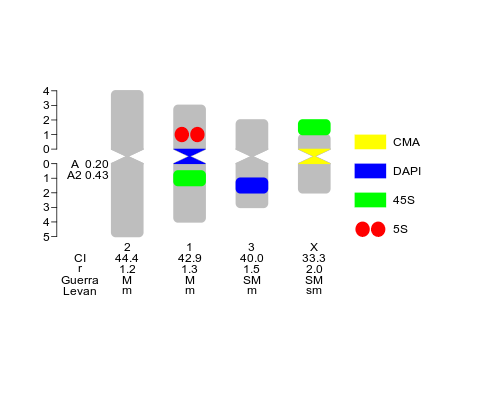
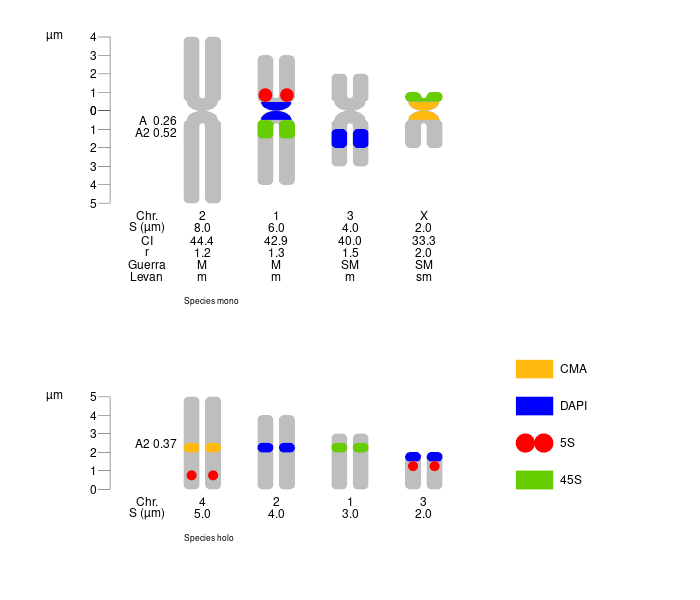

<link rel="stylesheet" href="css/mystyle.css">
<link rel="stylesheet" href="css/mystyle2.css">

```{r, echo=F, warning=FALSE, error=FALSE, comment=NA}

if(Sys.info()['sysname']=="Darwin") {

      system('echo "---" > index.Rmd')
      system('echo "title: \'Credits\'" >> index.Rmd')
      system('echo "author: \'Fernando Roa\'" >> index.Rmd')
      system('echo "date: \'23 08 2019\'" >> index.Rmd')
      system('echo "output:" >> index.Rmd')
      system('echo "  html_document" >> index.Rmd')
      system('echo "    highlight: github" >> index.Rmd')
      system('echo "    toc: true" >> index.Rmd')
      system('echo "    toc_depth: 1" >> index.Rmd')
      system('echo "    number_sections: true" >> index.Rmd')
      system('echo "vignette: >" >> index.Rmd')
      system('echo "  %\\VignetteIndexEntry{Credits}" >> index.Rmd')
      system('echo "  %\\VignetteEngine{knitr::rmarkdown}" >> index.Rmd')
      system('echo "  %\\VignetteEncoding{UTF-8}" >> index.Rmd')
      system('echo "---" >> index.Rmd')
      system('echo ""    >> index.Rmd')
      system('echo "visit https://ferroao.gitlab.io/idiogramfishhelppages" >> index.Rmd')
}

if( length(rmarkdown::pandoc_version()<2) > 0 ) { # solaris workaround
  
if(rmarkdown::pandoc_version() < 2 ) {
  message(crayon::red("\nMissing pandoc version > 2. Vignette may fail because it uses lua filter for multiple bibliographies
                      \nMore info:
                      \nhttps://stat.ethz.ch/pipermail/r-package-devel/2019q2/004127.html
                      \nhttps://stat.ethz.ch/pipermail/r-package-devel/2020q1/004814.html
                      \nLua filters are supported by rmarkdown
                      \nhttps://cran.r-project.org/web/packages/rmarkdown/vignettes/lua-filters.html
                      \nLua filters are an old characteristic of pandoc
                      \nhttps://pandoc.org/lua-filters.html
                      \nInstall pandoc >2 or try with package installr (if in Windows):
                      \nhttps://github.com/jgm/pandoc/releases")
          ) # me
  if(Sys.info()['sysname']=="Windows" ) {
    message("pandoc > 2 not available, see online vignettes")
    
    # remove vignettes with lua filter
    shell("del index.Rmd")
  
    #
    #    create new index.Rmd
    #
    
      shell("@echo off")
      shell('@echo --- > index.Rmd')
      shell('@echo title: "idiogramFISH: Idiograms with Marks and Karyotype Indices" >> index.Rmd')
      shell('@echo author: "Fernando Roa" >> index.Rmd')
      shell('@echo date: "23 08 2019" >> index.Rmd')
      shell('@echo output: >> index.Rmd')
      shell('@echo   html_document >> index.Rmd')
      shell('@echo     highlight: github >> index.Rmd')
      shell('@echo     toc: true >> index.Rmd')
      shell('@echo     toc_depth: 1 >> index.Rmd')
      shell('@echo     number_sections: true >> index.Rmd')
      shell('@echo vignette: ^> >> index.Rmd')
      shell("@echo   %\\VignetteIndexEntry{Credits} >> index.Rmd")
      shell('@echo   %\\VignetteEngine{knitr::rmarkdown} >> index.Rmd')
      shell('@echo   %\\VignetteEncoding{UTF-8} >> index.Rmd')
      shell('@echo --- >> index.Rmd')
      shell('@echo(     >> index.Rmd')
      shell('@echo pandoc ^> 2 not available, visit https://ferroao.gitlab.io/idiogramfishhelppages >> index.Rmd')

    } # if windows
  } # pandoc < 2
} # len
```
  
``` {r cssjs, results="asis", echo=FALSE, message=FALSE, eval=TRUE}
# <!-- pkgdown --> 
# <!-- jquery --><script src="js/jquery.min.js" crossorigin="anonymous"></script>
myfile<-"js/jquery.min.js"
if(file.exists(myfile)){
cat(paste0('<script src="',myfile,'" crossorigin="anonymous"></script> <!-- # -->'))
}
# <!-- clipboard.js --><script src="js/clipboard.min.js"  crossorigin="anonymous"></script>
myfile<-"js/clipboard.min.js"
if(file.exists(myfile)){
cat(paste0('<script src="',myfile,'"crossorigin="anonymous"></script>'))
}
# <!-- Font Awesome icons --><link rel="stylesheet" href="css/all.minMod.css"  crossorigin="anonymous">
myfile<-"css/all.minMod.css"
if(file.exists(myfile)){
cat(paste0('<link rel="stylesheet" href="',myfile,'"  crossorigin="anonymous">'))
}
# <!-- Bootstrap --><link rel="stylesheet" href="css/bootstrap.minO.css" crossorigin="anonymous">
myfile<-"css/bootstrap.minO.css"
if(file.exists(myfile)){
cat(paste0('<link rel="stylesheet" href="',myfile,'"  crossorigin="anonymous">'))
}
# <!-- # <script src="js/bootstrap.min.js"  crossorigin="anonymous"></script> -->
myfile<-"js/bootstrap.min.js"
if(file.exists(myfile)){
cat(paste0('<script src="',myfile,'" crossorigin="anonymous"></script> <!-- # -->'))
}
myfile<-"js/pkgdown2.js"
if(file.exists(myfile)){
cat(paste0('<script src="',myfile,'"></script> <!-- # -->'))
}
```

```{r setup, include=FALSE, eval=T}
#Create myheader.html
if(Sys.info()['sysname']=="Windows"){
res<-!as.logical(system(paste("ping", "www.google.com")) )
  if(res){
  fileConn <- file("myheader.html")
  writeLines('<script src="https://kit.fontawesome.com/af0a13599b.js" crossorigin="anonymous"></script>', fileConn)
  close(fileConn)
  }
} else {
  fileConn <- file("myheader.html")
  writeLines('<script src="https://kit.fontawesome.com/af0a13599b.js" crossorigin="anonymous"></script>', fileConn)
  close(fileConn)
}
require(idiogramFISH)
knitr::opts_chunk$set(eval = TRUE)
# knitr::opts_chunk$set(eval = FALSE)

# badge_devel_gitlab<-function(pkg, color){
#     v <- rvcheck:::check_github_gitlab(pkg, "gitlab")$latest_version
#     url <- paste0("https://gitlab.com/", pkg)
#     badger::badge_custom("devel version", v, color, url)
# }

```

``` {r, echo=F, message=FALSE, fig.show = "hold", fig.align = "default", results="asis"}
if (requireNamespace("RCurl", quietly = TRUE)  ) {
# version of manual
v<-sub("Version: ","",readLines("../DESCRIPTION")[3])
# v<-tryCatch(suppressWarnings(rvcheck:::check_github_gitlab("ferroao/idiogramFISH", "gitlab")$latest_version), error=function(e) NA )
pkg<-"idiogramFISH"
link<-tryCatch(suppressWarnings(badger::badge_custom("Documentation", paste(pkg,v), "cornflowerblue") ), error=function(e) NA )
  if(!is.na(link)) { 
  svglink<-gsub("\\[|\\]|!|\\(|\\)","", link)
  manual_cont <- tryCatch(suppressWarnings(RCurl::getURLContent(svglink) ), error=function(e) NA )
    if (!is.na(manual_cont)){
    manual_contFile <- "../man/figures/manual.svg"
    writeLines(manual_cont, con = manual_contFile)
    manual_contFile <- normalizePath(manual_contFile)
    knitr::include_graphics(manual_contFile)
    # cat(paste0("&nbsp;,")" ) )
    }
  }
} # rcurl
```

# Introduction {-}

<!-- <div style="width:150px;"> -->
<div style="float: right; width: 20%">
```{r, echo=F,  results="asis", eval=T}
img1_path <- "../man/figures/logo.png"
if(file.exists(img1_path)) {
cat(paste0("") )
}
```
</div>

The goal of idiogramFISH is to plot idiograms of karyotypes, plasmids and circular chr. having a set of data.frames for chromosome data
    and optionally marks' data (`plotIdiograms` function) [@Roa2020]. Idiograms can also be plotted in 
    concentric circles. Separated chromatids can be visible when not in a circular plot.<br>
    <br>Six styles of marks are available: square (squareLeft), dots, cM (cMLeft), cenStyle, upArrow, downArrow; its legend (label) can be drawn inline 
    or to the right of karyotypes. It is possible to calculate
    also chromosome and karyotype indexes [@Watanabe1999;@Zarco1986new] and classify chromosome morphology in the categories of
    Levan [-@Levan1964], and [Guerra](https://ferroao.gitlab.io/guerra1986/Guerra1986.pdf) [-@Guerra1986d].

IdiogramFISH was written in R [@R-base] and also uses crayon [@R-crayon], tidyr [@R-tidyr] and dplyr packages [@R-dplyr]. Documentation was written with R-packages roxygen2 [@R-roxygen2], usethis [@R-usethis], bookdown [@bookdown2016], knitr [@Xie2015], pkgdown [@R-pkgdown], Rmarkdown [@rmarkdown2018], rvcheck [@R-rvcheck], badger [@R-badger], kableExtra [@R-kableExtra], rmdformats [@R-rmdformats] and RCurl [@R-RCurl]. For some vignette figures, packages rentrez [@rentrez2017], plyr [@plyr2011], phytools [@phytools2012], ggtree [@ggtree2018], ggplot2 [@ggplot22016] and ggpubr [@R-ggpubr] were used. 

<div class="goright95">
<a href="#header">top <i class="fa fa-caret-square-o-up" aria-hidden="true"></i></a>
</div>

## Installation instructions {-}

``` {r, echo=F, message=FALSE, fig.show = "hold", fig.align = "default", results="asis"}

if (requireNamespace("RCurl", quietly = TRUE)  ) {
  
cranversion <- "https://www.r-pkg.org/badges/version/idiogramFISH"
cranversion_cont <- tryCatch(suppressWarnings(RCurl::getURLContent(cranversion) ), error=function(e) NA )

  if (!is.na(cranversion_cont)){
  cranversion_contFile <- "../man/figures/cranversion.svg"
  writeLines(cranversion_cont, con = cranversion_contFile)
  cranversion_contFile <- normalizePath(cranversion_contFile)
  # knitr::include_graphics(cranversion_contFile)
  # cat(paste0(",")" ) )
  cat(paste0("[,")](https://CRAN.R-project.org/package=idiogramFISH)" ) )
  } # cran version

# crandownloads<-"https://cranlogs.r-pkg.org/badges/grand-total/idiogramFISH?color=orange"
# crandownloads_cont <- tryCatch(suppressWarnings(RCurl::getURLContent(crandownloads) ), error=function(e) NA )

doibadge <- "https://zenodo.org/badge/DOI/10.5281/zenodo.3579417.svg"
doibadge_cont      <- tryCatch(suppressWarnings(RCurl::getURLContent(doibadge)      ), error=function(e) NA )

  if (!is.na(doibadge_cont)){
  doibadge_contFile <- "../man/figures/doibadge.svg"
  writeLines(doibadge_cont, con = doibadge_contFile)
  doibadge_contFile <- normalizePath(doibadge_contFile)
  
  cat(paste0("&nbsp;[         ,")](https://doi.org/10.5281/zenodo.3579417)" ) )
  } # doi

} # rcurl
```

You can install idiogramFISH from [CRAN](https://cran.r-project.org/package=idiogramFISH) with:

``` r
install.packages("idiogramFISH")
```
### Or the devel. version {-}

``` {r, echo=F, message=FALSE, warning=FALSE, include=TRUE, fig.show = "hold", fig.align = "default", results="asis"}
if (requireNamespace("RCurl", quietly = TRUE)  ) {
  # v<-tryCatch(suppressWarnings(rvcheck:::check_github_gitlab("ferroao/idiogramFISH", "gitlab")$latest_version), error=function(e) NA )
  v<-sub("Version: ","",readLines("../DESCRIPTION")[3])
  link<-tryCatch(suppressWarnings(badger::badge_custom("devel version", v, "cornflowerblue","?logo=gitlab") ), error=function(e) NA )
  if(!is.na(link)){
  svglink<-gsub("\\[|\\]|!|\\(|\\)","", link)
  gitbadge_cont <- tryCatch(suppressWarnings(RCurl::getURLContent(svglink) ), error=function(e) NA )
    if (!is.na(gitbadge_cont)){
    # gitbadge_contFile <- tempfile(fileext = ".svg")
    gitbadge_contFile <- "../man/figures/gitbadge.svg"
    writeLines(gitbadge_cont, con = gitbadge_contFile)
    gitbadge_contFile <- normalizePath(gitbadge_contFile)
    cat(paste0("[,")](https://gitlab.com/ferroao/idiogramFISH){target='_blank'}") )
    }
  }
}
```

Install Gitlab dev. ver. with devtools [@R-devtools]:

Attention windows users, please install [Rtools](https://cran.r-project.org/bin/windows/Rtools/){target="_blank"} and [git](https://git-scm.com/download/win)

Vignettes use a lua filter, so you would need [pandoc](https://pandoc.org/installing.html){target="_blank"} ver. > 2. `rmarkdown::pandoc_version()`

``` {r, eval=FALSE}
# This installs package devtools, necessary for installing the dev version
install.packages("devtools")

url <- "https://gitlab.com/ferroao/idiogramFISH"

# Necessary packages for vignettes:
list.of.packages <- c(
    "plyr",
    "knitr",
    "kableExtra",
    "rmdformats",
    "rmarkdown",
    "RCurl",
    "rvcheck",
    "badger",
    "rentrez"
    )
new.packages <- list.of.packages[!(list.of.packages %in% installed.packages()[,"Package"])]
if(length(new.packages)) install.packages(new.packages)

# Linux with vignettes and Windows
devtools::install_git(url = url,build_vignettes = TRUE, force=TRUE)

# Mac with vignettes
devtools::install_git(url = url, build_opts=c("--no-resave-data","--no-manual") )
```

#### Or install it in terminal: {-}

``` {r, eval=FALSE}
# clone repository:
git clone "https://gitlab.com/ferroao/idiogramFISH"

R CMD build idiogramFISH
# install
R CMD INSTALL idiogramFISH_*.tar.gz
```
<div class="goright95">
<a href="#header">top <i class="fa fa-caret-square-o-up" aria-hidden="true"></i></a>
</div>

## Releases {-}

``` {r, echo=F, message=FALSE, fig.show = "hold", fig.align = "default", results="asis"}
if (requireNamespace("RCurl", quietly = TRUE)  ) {
#cran version
v<-"NEWS"#tryCatch(suppressWarnings(rvcheck::check_cran("idiogramFISH")$latest_version), error=function(e) NA )

link<-tryCatch(suppressWarnings(badger::badge_custom("gitlab", paste(v), "orange","?logo=gitlab") ), error=function(e) NA )
  if(!is.na(link)){
  svglink<-gsub("\\[|\\]|!|\\(|\\)","", link)
  news_cont <- tryCatch(suppressWarnings(RCurl::getURLContent(svglink) ), error=function(e) NA )
    if (!is.na(news_cont)){
    news_cont_contFile <- "../man/figures/NEWS.svg"
    writeLines(news_cont, con = news_cont_contFile)
    cat(paste0("[,")](https://gitlab.com/ferroao/idiogramFISH/blob/master/NEWS.md){target='_blank'}" ) )
    }
  }
} # rcurl
```

<!-- [CRAN archive](https://cran.r-project.org/src/contrib/Archive/idiogramFISH/) -->

``` {r, echo=F, message=FALSE, fig.show = "hold", fig.align = "default", results="asis"}
if (requireNamespace("RCurl", quietly = TRUE)  ) {
archivelink<-tryCatch(suppressWarnings(badger::badge_custom("CRAN",  "archive","gray") ), error=function(e) NA )
if(!is.na(archivelink)){
svgnewdownlink<-gsub("\\[|\\]|!|\\(|\\)","", archivelink)
archive_cont <- tryCatch(suppressWarnings(RCurl::getURLContent(svgnewdownlink) ), error=function(e) NA )
}
if (!is.na(archive_cont)){
      archive_contFile <- "../man/figures/archive.svg"
      writeLines(archive_cont, con = archive_contFile)
      cat(paste0("[,")](https://cran.r-project.org/src/contrib/Archive/idiogramFISH){target='_blank'}" ) )
}
} # rcurl
```

``` {r, echo=F, message=FALSE, fig.show = "hold", fig.align = "default", results="asis"}
if (requireNamespace("RCurl", quietly = TRUE)  ) {
newdownlink<-tryCatch(suppressWarnings(badger::badge_custom("CRAN",  "downloads","green") ), error=function(e) NA )
if(!is.na(newdownlink)){
svgnewdownlink<-gsub("\\[|\\]|!|\\(|\\)","", newdownlink)
realdo_cont <- tryCatch(suppressWarnings(RCurl::getURLContent(svgnewdownlink) ), error=function(e) NA )
}
if (!is.na(realdo_cont)){
      realdo_contFile <- "../man/figures/realdownloads.svg"
      writeLines(realdo_cont, con = realdo_contFile)
                            # message                                              # link
      cat(paste0("[,")](https://ferroao.gitlab.io/idiogramfishhelppages/downloads.png){target='_blank'}" ) )
}
} # rcurl
```

<div class="goright95">
<a href="#header">top <i class="fa fa-caret-square-o-up" aria-hidden="true"></i></a>
</div>

## Need help? {-}

### Manual in Bookdown style {-}

``` {r, echo=F, message=FALSE, fig.show = "hold", fig.align = "default", results="asis"}
if (requireNamespace("RCurl", quietly = TRUE)  ) {
# version of manual
# v<-tryCatch(suppressWarnings(rvcheck:::check_github_gitlab("ferroao/idiogramFISH", "gitlab")$latest_version), error=function(e) NA )
#cran version
v<-tryCatch(suppressWarnings(rvcheck::check_cran("idiogramFISH")$latest_version), error=function(e) NA )

pkg<-"idiogramFISH"
link<-tryCatch(suppressWarnings(badger::badge_custom("bookdown", paste(pkg,v), "orange") ), error=function(e) NA )
  if(!is.na(link)){
  svglink<-gsub("\\[|\\]|!|\\(|\\)","", link)
  manual_cont <- tryCatch(suppressWarnings(RCurl::getURLContent(svglink) ), error=function(e) NA )
    if (!is.na(manual_cont)){
    bookdown_contFile <- "../man/figures/cranmanualbookdown.svg"
    writeLines(manual_cont, con = bookdown_contFile)
#    manual_contFile <- normalizePath(manual_contFile)
    # knitr::include_graphics(manual_contFile)
    cat(paste0("[,")](https://ferroao.gitlab.io/manualidiogramfish/)" ) )
    }
  }
} # rcurl
```

### Documentation in Pkgdown style {-}

``` {r, echo=F, message=FALSE, fig.show = "hold", fig.align = "default", results="asis"}
if (requireNamespace("RCurl", quietly = TRUE)  ) {
# version of manual
# v<-sub("Version: ","",readLines("DESCRIPTION")[3])
v<-tryCatch(suppressWarnings(rvcheck:::check_github_gitlab("ferroao/idiogramFISH", "gitlab")$latest_version), error=function(e) NA )
#cran version
# v<-tryCatch(suppressWarnings(rvcheck::check_cran("idiogramFISH")$latest_version), error=function(e) NA )

pkg<-"idiogramFISH"
pkglink<-tryCatch(suppressWarnings(badger::badge_custom("pkgdown", paste(pkg,v), "cornflowerblue") ), error=function(e) NA )
  if(!is.na(pkglink)){
  pkgsvglink<-gsub("\\[|\\]|!|\\(|\\)","", pkglink)
  develpkgmanual_cont <- tryCatch(suppressWarnings(RCurl::getURLContent(pkgsvglink) ), error=function(e) NA )
    if (!is.na(develpkgmanual_cont)){
    pkgdownmanual_contFile <- "../man/figures/pkgdownver.svg"
    writeLines(develpkgmanual_cont, con = pkgdownmanual_contFile)
    cat(paste0("[," )](https://ferroao.gitlab.io/idiogramFISH)" ) )
    }
  }
} # rcurl
```


### Vignettes: {-}

Online:

``` {r, echo=F, message=FALSE, fig.show = "hold", fig.align = "default", results="asis"}
if (requireNamespace("RCurl", quietly = TRUE)  ) {
# version of manual
# v<-sub("Version: ","",readLines("DESCRIPTION")[3])
v<-tryCatch(suppressWarnings(rvcheck:::check_github_gitlab("ferroao/idiogramFISH", "gitlab")$latest_version), error=function(e) NA )
#cran version
# v<-tryCatch(suppressWarnings(rvcheck::check_cran("idiogramFISH")$latest_version), error=function(e) NA )

pkg<-"idiogramFISH"
link<-tryCatch(suppressWarnings(badger::badge_custom("vignettes", paste(pkg,v), "cornflowerblue") ), error=function(e) NA )
  if(!is.na(link)){
  vignettelink<-gsub("\\[|\\]|!|\\(|\\)","", link)
  vignettemanual_cont <- tryCatch(suppressWarnings(RCurl::getURLContent(vignettelink) ), error=function(e) NA )
    if (!is.na(vignettemanual_cont)){
    vignettemanual_contFile <- "../man/figures/develmanualvignette.svg"
    writeLines(vignettemanual_cont, con = vignettemanual_contFile)
#    manual_contFile <- normalizePath(manual_contFile)
    # knitr::include_graphics(manual_contFile)
    cat(paste0("[,")](https://ferroao.gitlab.io/idiogramfishhelppages)" ) )
    }
  }
} # rcurl
```

Launch vignettes from R for the installed version:
``` r
packageVersion("idiogramFISH")
browseVignettes("idiogramFISH")
```
<div class="goright95">
<a href="#header">top <i class="fa fa-caret-square-o-up" aria-hidden="true"></i></a>
</div>


## Minimal examples {-}

### Monocentrics: {-}

Define your plotting window size with something like `par(pin=c(10,6))`, or with `svg()`, `png()`, etc.
Add chromosome morphology according to [Guerra](https://ferroao.gitlab.io/guerra1986/Guerra1986.pdf) [-@Guerra1986d] or [@Levan1964]

```{r , echo=TRUE, results="hide", message=FALSE}
library(idiogramFISH)

data(dfOfChrSize) # chromsome data
data(dfMarkColor) # mark general data
data(dfOfMarks2)  # mark position data (inc. cen.)

# column Mbp not for plotting purposes
dfOfChrSize$Mbp<-(dfOfChrSize$shortArmSize+dfOfChrSize$longArmSize)*100

svg("dfOfChrSize.svg",width=10,height=6 )
# png("dfOfChrSize.png", width=500, height=400)
plotIdiograms(dfChrSize  =dfOfChrSize,  # data.frame of chr. size
              dfMarkColor=dfMarkColor,  # d.f of mark style <- Optional
              dfMarkPos=dfOfMarks2,     # df of mark positions (includes cen. marks)
              
              karHeight=5,              # kar. height
              chrWidth = 1.2,           # chr. width
              chrSpacing = 1,           # space among chr.
              
              morpho="Guerra",          # chr. morpho. classif. (Guerra, Levan, both, "" ) ver. >= 1.12 only
              chrIndex="CI",            # cen. pos. (CI, AR, both, "" ) ver. >= 1.12 only
              chrSize = TRUE,           # add chr. sizes under chr.
              chrSizeMbp = TRUE,        # add Mbp sizes under chr. (see above)
              
              rulerPos= 0,              # position of ruler
              ruler.tck=-0.01,          # size and orientation of ruler ticks
              rulerNumberSize=.8        # font size of rulers
              ,xPosRulerTitle = 3             # pos of ruler title
              
              ,legendWidth=1            # width of legend items
              ,fixCenBorder = TRUE      # use chrColor as border color of cen. or cen. marks
              ,distTextChr = 1.2        # chr. text separation
              
              ,xlimLeftMod = 2          # xlim left param.
              ,ylimBotMod = 0           # modify ylim bottom argument
              ,ylimTopMod = 0           # modify ylim top argument
)
dev.off() # close svg()
```

```{r, results="asis", comment=NA, echo=FALSE}
# cat(paste0("" ) )
cat(paste0("" ) )
```

###  Let's explore the data.frames for monocentrics: {-}

If only one species, column OTU is optional

<div class="pre-scrollx">
```{r, results="hide"}
dfOfChrSize
```
</div>

<div class="verysmall">
``` {r, monocentrics, echo=FALSE, comment=NA}
# chromsome data, if only 1 species, column OTU is optional
kableExtra::kable_styling(knitr::kable(dfOfChrSize) , full_width = F)
# mark general data
```
</div>

<div class="pre-scrollx">
```{r, results="hide"}
dfMarkColor
```
</div>

<div class="verysmall">
``` {r, echo=FALSE, comment=NA}
kableExtra::kable_styling(knitr::kable(dfMarkColor) , full_width = F)
```
</div>

`p, q` and `w` marks can have empty columns `markDistCen` and `markSize` since v. 1.9.1 to plot whole arms (`p`, `q`) and whole chr. `w`.

<div class="pre-scrollx">
```{r, results="hide"}
# mark position data (inc. cen.) 
dfOfMarks2
```
</div>

<div class="verysmall">
``` {r, echo=FALSE, comment=NA}
kableExtra::kable_styling(knitr::kable(dfOfMarks2) , full_width = F)
```
</div>
  
### Holocentrics: {-}

```{r example2, echo=TRUE, results="hide", fig.width=10, fig.height=6, message=FALSE}
library(idiogramFISH)

# load some package data.frames - optional
data(dfChrSizeHolo, dfMarkColor, dfMarkPosHolo)

# column Mbp not for plotting purposes
dfChrSizeHolo$Mbp<-dfChrSizeHolo$chrSize*100

# svg("testing.svg",width=14,height=8 )
par(mar = c(0, 0, 0, 0), omi=rep(0,4) )

plotIdiograms(dfChrSize  =dfChrSizeHolo, # data.frame of chr. size
              dfMarkColor=dfMarkColor,   # df of mark style
              dfMarkPos  =dfMarkPosHolo, # df of mark positions
              
              addOTUName=FALSE,        # do not add OTU names
              distTextChr = 1,         # chr. name distance to chr.
              chrSize = TRUE,          # show chr. size under chr.
              chrSizeMbp = TRUE,       # show chr. size in Mbp under chr. requires Mbp column
              
              rulerPos=-0.1,           # position of ruler
              rulerNumberPos=.9        # position of numbers of rulers
              ,xPosRulerTitle = 3            # pos. of ruler title (units)
              
              ,xlimLeftMod=2           # modify xlim left argument of plot
              ,ylimBotMod=.2           # modify ylim bottom argument of plot
              ,legendHeight=.5         # height of legend labels
              ,legendWidth = 1.2       # width of legend labels
              ,xModifier = .025        # separ. among chromatids
              )                  
# dev.off() # close svg()
```

### Let's explore the data.frames for holocentrics: {-}

* chromosome data, if only 1 species, column OTU is optional

<div class="pre-scrollx">
```{r, results="hide"}
dfChrSizeHolo
```
</div>

<div class="verysmall">
```{r holocentrics, echo=FALSE, comment=NA}

kableExtra::kable_styling(knitr::kable(dfChrSizeHolo) , full_width = F)
```
</div>

* mark general data

<div class="pre-scrollx">
```{r, results="hide"}
dfMarkColor
```
</div>

<div class="verysmall">
```{r, echo=FALSE, comment=NA}
kableExtra::kable_styling(knitr::kable(dfMarkColor) , full_width = F)
```

* mark position data, if only 1 species, column OTU is optional (mandatory if in d.f of Chr. Size)

<div class="pre-scrollx">
```{r, results="hide"}
dfMarkPosHolo
```
</div>

<div class="verysmall">
```{r, echo=FALSE, comment=NA}
kableExtra::kable_styling(knitr::kable(dfMarkPosHolo) , full_width = F)
```
</div>

### Plotting both mono. and holo. {-}

Available only for ver. > 1.5.1  

Merge data.frames with `plyr` [@plyr2011]

```{r, echo=T,  comment=NA, results="hide", message=FALSE}
# chromosome data, if only 1 species, column OTU is optional
require(plyr)
dfOfChrSize$OTU   <- "Species mono"
dfChrSizeHolo$OTU <- "Species holo"
 
monoholoCS <- plyr::rbind.fill(dfOfChrSize,dfChrSizeHolo)

dfOfMarks2$OTU     <-"Species mono"
dfOfMarks2[which(dfOfMarks2$markName=="5S"),]$markSize<-.7
dfMarkPosHolo$OTU <-"Species holo"

monoholoMarks <- plyr::rbind.fill(dfOfMarks2,dfMarkPosHolo)
```

```{r, echo=T, results="hide", fig.width=10, fig.height=6, message=FALSE}
library(idiogramFISH)

#svg("testing.svg",width=14,height=10 )
png("monoholoCS.png", width=700, height=600)
par(mar=rep(0,4))
plotIdiograms(dfChrSize  = monoholoCS,   # data.frame of chr. size
              dfMarkColor= dfMarkColor,  # df of mark style
              dfMarkPos  = monoholoMarks,# df of mark positions, includes cen. marks
              
              chrSize = TRUE,            # show chr. size under chr.
              
              squareness = 4,            # vertices squareness
              roundedCen = FALSE,        # triangular cen.
              addOTUName = TRUE,         # add OTU names
              OTUTextSize = .7,          # font size of OTU
              distTextChr = .5,          # separ. among chr. and text and among chr. name and indices
              
              karHeiSpace = 4,           # karyotype height inc. spacing
              karIndexPos = .2,          # move karyotype index
              
              legendHeight= 1,           # height of legend labels
              legendWidth = 1,           # width of legend labels
              fixCenBorder = TRUE,       # use chrColor as border color of cen. or cen. marks
              
              rulerPos= 0,               # position of ruler
              ruler.tck=-0.02,           # size and orientation of ruler ticks
              rulerNumberPos=.9,         # position of numbers of rulers
              xPosRulerTitle = 3.5,      # ruler title (units) position
              
              xlimLeftMod=1,             # modify xlim left argument of plot
              xlimRightMod=3,            # modify xlim right argument of plot
              ylimBotMod= .2             # modify ylim bottom argument of plot
              
              ,chromatids=FALSE          # do not show separ. chromatids
              
              # for Circular Plot, add:
              
              # ,circularPlot = TRUE       # circularPlot
              # ,shrinkFactor = .9         # percentage 1 = 100% of circle with chr.
              # ,circleCenter = 3          # X coordinate of circleCenter (affects legend pos.)
              # ,chrLabelSpacing = .9      # chr. names spacing
              
              # ,OTUsrt = 0                # angle for OTU name (or number)
              # ,OTUplacing = "number"     # Use number and legend instead of name
              # ,OTULabelSpacerx = -1.5    # modify position of OTU label, when OTUplacing="number" or "simple"
              # ,OTUlegendHeight = 1.5     # space among OTU names when in legend - OTUplacing
)
dev.off() # close png
```

```{r, results="asis", comment=NA, echo=FALSE}
# cat(paste0("" ) )
cat(paste0("" ) )
```

```{r, echo=FALSE, results="hide", fig.width=10, fig.height=7, message=FALSE}
library(idiogramFISH)

# svg("testing.svg",width=14,height=10 )
par(mar=rep(0,4))
plotIdiograms(dfChrSize  = monoholoCS,   # data.frame of chr. size
              dfMarkColor= dfMarkColor,  # df of mark style
              dfMarkPos  = monoholoMarks,# df of mark positions, includes cen. marks
              
              squareness = 4,            # vertices squareness
              roundedCen = FALSE,        # triangular cen.
              addOTUName = TRUE,         # add OTU names
              distTextChr = .5,          # separ. among chr. and text and among chr. name and indices
              
              karHeiSpace = 3,           # karyotype height inc. spacing
              karIndexPos = .2,          # move karyotype index
              
              legendHeight= 1,           # height of legend labels
              legendWidth = 1,           # width of legend labels
              fixCenBorder = TRUE,       # use chrColor as border color of cen. or cen. marks
              
              rulerPos= 0,               # position of ruler
              ruler.tck=-0.02,           # size and orientation of ruler ticks
              rulerNumberPos=.9,         # position of numbers of rulers
              
              xlimLeftMod=1,             # modify xlim left argument of plot
              xlimRightMod=3,            # modify xlim right argument of plot
              ylimBotMod= .2             # modify ylim bottom argument of plot
              
              ,circularPlot = T          # circularPlot
              ,shrinkFactor = .9         # percentage 1 = 100% of circle with chr.
              ,circleCenter = 3          # X coordinate of circleCenter (affects legend pos.)
              ,OTUsrt = 0                # angle for OTU name (or number)
              ,OTUplacing = "number"     # Use number and legend instead of name
              ,chrLabelSpacing = .9      # chr. names spacing
              ,OTULabelSpacerx = -1.5    # modify position of OTU label, when OTUplacing="number" or "simple"
              ,OTUlegendHeight = 1.5     # space among OTU names when in legend - OTUplacing
              ,OTUTextSize = .7          # font size of OTU
)
#dev.off() # close svg()
```

## Citation {-}

```{r citation, echo=FALSE, comment=NA,results='asis'} 
print(citation("idiogramFISH"),bibtex=FALSE )
```

To write citation to file:
```{r, echo=TRUE, results=FALSE, eval=FALSE}
sink("idiogramFISH.bib")
toBibtex(citation("idiogramFISH"))
sink()
```
<div class="goright95">
<a href="#header">top <i class="fa fa-caret-square-o-up" aria-hidden="true"></i></a>
</div>

## Authors {-}


```{r, echo=F,  results="asis", eval=T}
img1_path <- "../man/figures/kofi1.png"
img1_path <- normalizePath(img1_path)

if(file.exists(img1_path)) {
  cat(paste0("[Fernando Roa](https://ferroao.gitlab.io/curriculumpu/){target='_blank'}&nbsp;&nbsp;<a href='https://ko-fi.com/X7X71PZZG' target='_blank'>") )
} else {
  cat(paste0("[Fernando Roa](https://ferroao.gitlab.io/curriculumpu/){target='_blank'}"))  
}
```

``` {r, echo=F, message=FALSE, fig.show = "hold", fig.align = "default", results="asis", eval=FALSE}
cat("<a href='https://ko-fi.com/X7X71PZZG' target='_blank'></a>")
```
  
  
  
[Mariana PC Telles](http://lattes.cnpq.br/4648436798023532)  

```{r include=FALSE,eval=FALSE}
# automatically create a bib database for R packages, this is currently not used by vignette refs/packages2.bib
knitr::write_bib(c(
  .packages(), 'bookdown', 'knitr', 'rmarkdown',"devtools","pkgdown","crayon","ggtree","ggplot2","ggpubr","phytools","plyr","dplyr","tidyr","rentrez"
), 'refs/packages2.bib')
```
<div class="goright95">
<a href="#header">top <i class="fa fa-caret-square-o-up" aria-hidden="true"></i></a>
</div>


```{r, echo=F}
chapterFile_plotting<- "../chapters/01-plotting.Rmd"
if(file.exists(chapterFile_plotting)){
  childExists_plotting<-TRUE
  child_docs_plotting <- chapterFile_plotting
} else {
  childExists_plotting<-FALSE
  child_docs_plotting <- ""
}
```

```{r, child = child_docs_plotting, eval=childExists_plotting}
```

```{r, results="asis", eval=!childExists_plotting, echo=FALSE}
cat("# Plotting chromosomes")
```
```{r, results="asis", eval=!childExists_plotting, echo=FALSE}
cat("[https://ferroao.gitlab.io/idiogramfishhelppages](https://ferroao.gitlab.io/idiogramfishhelppages/#plotting-chromosomes)")
```


```{r, echo=F}
chapterFile_multiple<- "../chaptersBLOCK/02-multiple.Rmd"
if(file.exists(chapterFile_multiple)){
  childExists_multiple<-TRUE
  child_docs_multiple <- chapterFile_multiple
} else {
  childExists_multiple<-FALSE
  child_docs_multiple <- ""
}
```

```{r, child = child_docs_multiple, eval=childExists_multiple}
```

```{r, results="asis", eval=!childExists_multiple, echo=FALSE}
cat("# Several OTUs")
```
```{r, results="asis", eval=!childExists_multiple, echo=FALSE}
cat("[https://ferroao.gitlab.io/idiogramfishhelppages](https://ferroao.gitlab.io/idiogramfishhelppages/#multiple-otus)")
```


```{r, echo=F}
chapterFile_units<- "../chaptersBLOCK/03-units.Rmd"
if(file.exists(chapterFile_units)){
  childExists_units<-TRUE
  child_docs_units <- chapterFile_units
} else {
  childExists_units<-FALSE
  child_docs_units <- ""
}
```

```{r, child = child_docs_units, eval=childExists_units}
```

```{r, results="asis", eval=!childExists_units, echo=FALSE}
cat("# Changing Units")
```
```{r, results="asis", eval=!childExists_units, echo=FALSE}
cat("[https://ferroao.gitlab.io/idiogramfishhelppages](https://ferroao.gitlab.io/idiogramfishhelppages/#changing-units)")
```


```{r, echo=F}
chapterFile0<- "../chaptersBLOCK/04-gish.Rmd"
if(file.exists(chapterFile0)){
  childExists0<-TRUE
  child_docs0 <- chapterFile0
} else {
  childExists0<-FALSE
  child_docs0 <- ""
}
```

```{r, child = child_docs0, eval=childExists0}
```

```{r, results="asis", eval=!childExists0, echo=FALSE}
cat("# GISH")
```
```{r, results="asis", eval=!childExists0, echo=FALSE}
cat("[https://ferroao.gitlab.io/idiogramfishhelppages](https://ferroao.gitlab.io/idiogramfishhelppages/#gish)")
```


```{r, echo=F}
chapterFile1<- "../chaptersBLOCK/05-groups.Rmd"
if(file.exists(chapterFile1)){
  childExists1<-TRUE
  child_docs1 <- chapterFile1
} else {
  childExists1<-FALSE
  child_docs1 <- ""
}
```

```{r, child = child_docs1, eval=childExists1}
```

```{r, results="asis", eval=!childExists1, echo=FALSE}
cat("# Using groups")
```
```{r, results="asis", eval=!childExists1, echo=FALSE}
cat("[https://ferroao.gitlab.io/idiogramfishhelppages](https://ferroao.gitlab.io/idiogramfishhelppages/#groups)")
```


```{r, echo=F}
chapterFile2<- "../chaptersBLOCK/06-circular.Rmd"
if(file.exists(chapterFile2)){
  childExists2<-TRUE
  child_docs2 <- chapterFile2
} else {
  childExists2<-FALSE
  child_docs2<-""
}
```

```{r, child = child_docs2, eval = childExists2}
```

```{r, results="asis", eval=!childExists2, echo=FALSE}
cat("# Circular plots")
```
```{r, results="asis", eval=!childExists2, echo=FALSE}
cat("[https://ferroao.gitlab.io/idiogramfishhelppages](https://ferroao.gitlab.io/idiogramfishhelppages/#circular-plots)")
```


```{r, echo=F}
chapterFile3<- "../chaptersBLOCK/07-phylogeny.Rmd"
if(file.exists(chapterFile3)){
  childExists3<-TRUE
  child_docs3 <- chapterFile3
} else {
  childExists3<-FALSE
  child_docs3<-""
}
```

```{r, child = child_docs3, eval=childExists3}
```

```{r, results="asis", eval=!childExists3, echo=FALSE}
cat("# Plotting alongside phylogeny")
```
```{r, results="asis", eval=!childExists3, echo=FALSE}
cat("[https://ferroao.gitlab.io/idiogramfishhelppages](https://ferroao.gitlab.io/idiogramfishhelppages/#plotting-alongside-phylogeny)")
```


```{r, echo=F}
chapterFile<- "../chaptersBLOCK/08-citrushelp.Rmd"
if(file.exists(chapterFile)){
  childExists<-TRUE
  child_docs <- chapterFile
} else {
  childExists<-FALSE
  child_docs<-""
}
```

```{r, child = child_docs, eval=childExists}
```

```{r, results="asis", eval=!childExists, echo=FALSE}
cat("# *Citrus* - helper functions")
```
```{r, results="asis", eval=!childExists, echo=FALSE}
cat("[https://ferroao.gitlab.io/idiogramfishhelppages](https://ferroao.gitlab.io/idiogramfishhelppages/#citrus---helper-functions)")
```

```{r, echo=F}
chapterFile4<- "../chaptersBLOCK/09-human.Rmd"
if(file.exists(chapterFile4)){
  childExists4<-TRUE
  child_docs4 <- chapterFile4
} else {
  childExists4<-FALSE
  child_docs4<-""
}
```

```{r, child = child_docs4, eval=childExists4}
```

```{r, results="asis", eval=!childExists4, echo=FALSE}
cat("# Human karyotype")
```
```{r, results="asis", eval=!childExists4, echo=FALSE}
cat("[https://ferroao.gitlab.io/idiogramfishhelppages](https://ferroao.gitlab.io/idiogramfishhelppages/#human-karyotype)")
```

```{r, echo=F}
chapterFile_param<- "../chaptersBLOCK/10-functions.Rmd"
if(file.exists(chapterFile_param)){
  childExists_param<-TRUE
  child_docs_param <- chapterFile_param
} else {
  childExists_param<-FALSE
  child_docs_param<-""
}
```

```{r, child = child_docs_param, eval=childExists_param}
```

```{r, results="asis", eval=!childExists_param, echo=FALSE}
cat("# Functions")
```
```{r, results="asis", eval=!childExists_param, echo=FALSE}
cat("[https://ferroao.gitlab.io/idiogramfishhelppages](https://ferroao.gitlab.io/idiogramfishhelppages/#functions)")
```


```{r, echo=F}
chapterFile_news<- "../chaptersBLOCK/11-news.Rmd"
if(file.exists(chapterFile_news)){
  childExists_news<-TRUE
  child_docs_news <- chapterFile_news
} else {
  childExists_news<-FALSE
  child_docs_news<-""
}
```

```{r, child = child_docs_news, eval=childExists_news}
```

```{r, results="asis", eval=!childExists_news, echo=FALSE}
cat("# News {-}")
```
```{r, results="asis", eval=!childExists_news, echo=FALSE}
cat("[https://ferroao.gitlab.io/idiogramfishhelppages](https://ferroao.gitlab.io/idiogramfishhelppages/#news)")
```


# References {-}

::: {#refs_normal}
:::

## R-packages {-}

::: {#refs_software}
:::

## Documentation {-}

::: {#refs_docs}
:::


